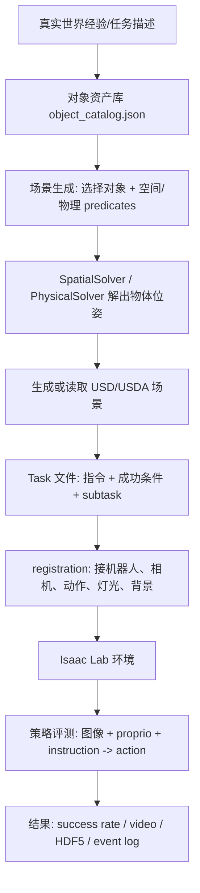

# 精讲 1：真实场景到模拟场景的评估，代码怎么实现

> [!NOTE]
> **颜色标识**：绿色表示核心结论，蓝色表示源码/输入输出路径，橙色表示边界、风险和容易误解的点。

## 先说结论

论文这段不是说 RoboLab 自己在主流程里做“真实视频 -> 3DGS/NeRF -> 数字孪生场景”的逐场景重建。RoboLab 的核心思路更务实：

> 不逐个真实场景做昂贵三维重建，而是用已有的高质量 USD/SimReady 资产、HDR 背景、物理参数、程序化场景布局、任务谓词和扰动矩阵，快速生成一批“足够逼真、可交互、可自动评分”的仿真评测场景。

> [!TIP]
> **核心结论**：RoboLab 的 real-to-sim 思路不是“从真实视频逐场景重建”，而是“用高质量资产库 + 程序化布局 + 物理检查 + 任务谓词”快速生成可评测场景。

所以代码实现的重点不是 `video_to_3dgs.py` 这类重建脚本，而是下面这条 pipeline：

> [!WARNING]
> **注意边界**：如果在仓库里找不到 `video_to_3dgs.py` 这类脚本，不是复现漏掉了主流程；论文这里强调的是更快的资产化、程序化评估路线。



## 1. 资产库：用真实物体的 USD 资产替代逐场景重建

核心路径：

```text
assets/objects/
assets/objects/object_catalog.json
assets/scenes/
assets/backgrounds/
assets/materials/
```

代码入口：

```text
robolab/constants.py
```

> [!NOTE]
> **源码入口**：先看 `robolab/constants.py` 和 `assets/objects/object_catalog.json`。前者定义目录，后者定义可生成、可放置、可验证的对象资产。

关键逻辑：

- `ASSET_DIR = <repo>/assets`
- `OBJECT_DIR = assets/objects`
- `SCENE_DIR = assets/scenes`
- `BACKGROUND_ASSET_DIR = assets/backgrounds`
- `OBJECT_CATALOG_PATH = assets/objects/object_catalog.json`

`object_catalog.json` 是这套方法的基础。每个对象不只是一个名字，还包含：

| 字段 | 作用 |
|---|---|
| `name` | 任务和谓词里使用的对象名 |
| `usd_path` | 真实加载的 USD 资产 |
| `class` / `description` | 语义类别和自然语言描述，用于选物体 |
| `dims` | 几何尺寸，用于放置和碰撞检测 |
| `mass` / friction / restitution | 物理参数，用于可交互仿真 |

例如我们跑的 `BananaInBowlTask` 里：

- `banana` 来自 `assets/objects/ycb/banana.usd`
- `bowl` 来自 `assets/objects/ycb/bowl.usd`
- 两者都有尺寸、质量、摩擦等属性

说人话：RoboLab 不是每次从真实视频里重新重建香蕉和碗，而是复用一个可物理交互的香蕉 USD 和碗 USD，再把它们摆到新的任务场景里。

## 2. 场景文件：USD/USDA 里保存“桌子、物体、材质、位姿”

核心路径：

```text
assets/scenes/banana_bowl.usda
assets/scenes/base_empty.usda
```

`banana_bowl.usda` 里可以看到对象是通过 USD payload 引入的：

```text
def "bowl" (
    prepend payload = @../objects/ycb/bowl.usd@
)
...
double3 xformOp:translate = (0.5611, 0.1526, 0.0303)

def "banana" (
    prepend payload = @../objects/ycb/banana.usd@
)
...
double3 xformOp:translate = (0.5097, -0.1158, 0.0212)
```

也就是说，一个场景本质上是：

- 基础桌面、地面、物理世界配置
- 若干对象 USD payload
- 每个对象的位姿、旋转、缩放
- 材质和纹理

这就是“几分钟生成场景”的关键：生成/修改一个 USDA 文件比训练一个 3DGS 快得多。

## 3. 从“真实场景经验”到“可评估仿真”的最小闭环

这里不再展开 `SpatialSolver`、`PhysicalSolver`、`Task` 字段和 env registration 的细节，那些是精讲2的核心内容。本节只保留 real-to-sim 评估需要的骨架：

| 阶段 | 输入 | 输出 | 为什么对 real-to-sim 评估重要 |
|---|---|---|---|
| 资产化 | 真实物体类别、尺寸、材质经验 | `object_catalog.json` + USD 资产 | 让“真实物体”变成可复用、可物理交互的模拟对象 |
| 场景化 | 物体组合、空间关系、容器/堆叠关系 | `.usda` 场景 | 用低成本方式生成大量可控场景，而不是逐场景重建 |
| 任务化 | 目标状态和语言指令 | `Task` 类、success predicate、subtask | 把“看起来像”升级成“能不能完成任务” |
| 环境化 | 机器人、相机、动作空间、光照、背景 | Isaac Lab/Gym env | 让同一任务可被策略批量执行和复现实验 |
| 评估化 | policy、num_envs、num_runs、扰动矩阵 | success/video/HDF5/log | 输出可比较的成功率、耗时、失败类型和视频证据 |

> [!NOTE]
> **章节分工**：本节只讲 real-to-sim 评估链路为什么成立；`scene_gen`、`import_scene`、`Task`、registration 的代码细节见 [EXPLAIN_02_scene_task_env_generation.md](./EXPLAIN_02_scene_task_env_generation.md)；自动生成 Task 和验证闭环见 [EXPLAIN_03_task_generation_validation.md](./EXPLAIN_03_task_generation_validation.md)。

### 3.1 这里的“逼真”不是单纯像素相似

RoboLab 对逼真的要求更工程化：场景需要足够支持策略评测，而不是逐像素复刻某个真实厨房视频。换句话说，评估关心的是：

- 视觉上是否有足够真实的物体、纹理、背景和相机视角，让 VLA 模型产生合理感知输入。
- 几何上是否有正确的尺寸、相对位置、容器开口、堆叠关系。
- 物理上是否能抓取、接触、放置、释放，而不是只有静态渲染。
- 任务上是否能自动判断成功/失败，而不是靠人工看视频。

这也是为什么 `object_catalog.json`、`.usda`、success predicate、subtask log、video/HDF5 这些东西比单纯渲染截图更重要。

### 3.2 控制变量比单一场景重建更有评测价值

逐场景 3DGS/NeRF 的优势是像某一个真实场景，但代价是慢、难扩展、难自动评分。RoboLab 选择另一条路线：

```text
同一个任务目标
  × 多个物体组合
  × 多个空间关系
  × 多个背景/光照/相机扰动
  × 多个策略模型
  -> 得到可横向比较的 success rate 和失败模式
```

这对评测 VLA 泛化能力更直接：我们可以问“模型是不是只在默认背景能成功”“是不是颜色换一下就失败”“是不是多物体目标会显著掉分”，而不只是问“这个渲染像不像某段真实视频”。

## 4. 评估输出：不是只看画面像不像，而是看策略能不能完成任务

完整评估入口：

```text
policies/pi0_family/run.py
robolab/eval/runner.py
robolab/eval/episode.py
robolab/eval/summarize.py
```

运行时输入：

```text
task/env name
policy client
num_envs
num_runs
instruction_type
video_mode
```

输出：

| 文件 | 用途 |
|---|---|
| `episode_results.jsonl` | 每个 episode 的成功/失败、步数、耗时、指标 |
| `run_0.hdf5` | 轨迹、动作、物体状态、bbox、末端位姿 |
| `log_0_env0.json` | 每个 env 的事件日志 |
| `.mp4` | sensor / viewport 视频 |
| `env_cfg.json` | 本轮环境配置证据 |

我们已经跑通的单任务复现就是这个机制：

```text
BananaInBowlTask
policy = pi05
success = true
episode_step = 198
video = Pick_up_the_banana_and_place_it_in_the_bowl_0.mp4
viewport video = Pick_up_the_banana_and_place_it_in_the_bowl_0_viewport.mp4
```

## 5. 这段论文对应代码的一句话总结

论文说“相比逐场景 3D 重建，RoboLab 几分钟生成大规模逼真场景和任务”，代码上对应的不是某一个神奇重建脚本，而是一套评估工程：

1. **复用资产**：用 `object_catalog.json` 和 USD 资产把真实物体经验变成可复用模拟对象。
2. **控制变量**：用场景、任务、背景、光照、相机组合出可控扰动矩阵。
3. **自动评分**：用 success predicate 和 subtask log 判断任务完成，而不是人工看视频。
4. **证据闭环**：用 `episode_results.jsonl`、HDF5、event log、视频记录每次策略运行。
5. **横向比较**：同一套任务可替换 policy、背景、相机和难度，用成功率和失败模式比较泛化能力。

## 6. 要记住的边界

RoboLab 主线不是：

```text
真实视频 -> 3DGS/NeRF 重建 -> 单个数字孪生场景
```

RoboLab 主线是：

```text
真实物体/场景经验 -> 可复用 USD 资产 -> 程序化/LLM 辅助生成场景 -> 任务定义 -> 批量策略评测
```

所以它牺牲了一点“逐场景像素级一致性”，换来：

- 更低生成成本；
- 更容易扩展到 100+ 任务；
- 能自动打分；
- 能系统改变背景、光照、相机、物体组合；
- 更适合比较 VLA 策略的泛化能力。
