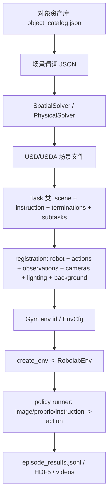

# 精讲 2：场景、任务和环境生成，代码怎么实现

> [!NOTE]
> **颜色标识**：绿色表示核心结论，蓝色表示源码/输入输出路径，橙色表示边界、风险和容易误解的点。

## 先说结论

论文这段可以拆成三层：

1. **创建场景**：先决定工作空间里有哪些物体、物体放在哪、朝向是什么，最后落成一个 USD/USDA 场景文件。
2. **定义任务**：再把“目标状态”写成语言指令和成功条件，例如“魔方在碗左边”“所有红色物体在灰色盒子里”。
3. **实例化环境**：最后选择机器人、动作空间、策略观测相机、viewport 相机、灯光、背景，再注册成 Gym/Isaac Lab 环境，供 policy runner 执行。

说人话：**场景是舞台，任务是目标，环境是把舞台、目标、机器人和摄像机装配成一次可运行实验。**

> [!TIP]
> **核心结论**：这一节要记住三件事：场景负责“有什么、在哪里”，任务负责“要达到什么目标”，环境负责“把机器人、相机、动作和评测输出装配起来”。



注意一个边界：RoboLab benchmark 运行时通常直接读取已经生成好的 `assets/scenes/*.usda`。`robolab/scene_gen/llm_scene_gen/` 是“如何生成新场景”的代码能力；评测时不一定每次重新生成场景。

> [!WARNING]
> **注意边界**：复现 benchmark 时，主流程通常是读取现成 `.usda` 场景；`scene_gen` 更像扩展和生成新任务/新场景的能力，不等于每次评测都在线生成。

## 1. 场景生成：把物体定位和定向

核心文件：

```text
robolab/scene_gen/llm_scene_gen/predicates.py
robolab/scene_gen/llm_scene_gen/spatial_solver.py
robolab/scene_gen/llm_scene_gen/physical_solver.py
skills/robolab-scenegen/SKILL.md
assets/objects/object_catalog.json
assets/scenes/base_empty.usda
assets/scenes/*.usda
robolab/core/scenes/utils.py
```

> [!NOTE]
> **源码入口**：场景生成先看 `predicates.py`、`spatial_solver.py`、`physical_solver.py`；任务装配看 `robolab/tasks/benchmark/*.py`；环境注册看 `registrations/` 和 `core/environments/runtime.py`。

### 输入是什么

场景生成的输入不是一张图片，而是结构化信息：

| 输入 | 例子 | 作用 |
|---|---|---|
| 对象目录 | `object_catalog.json` | 知道有哪些物体、USD 路径、尺寸、质量等 |
| 谓词 JSON | `left-of`, `place-on-base`, `place-in` | 描述物体之间的空间/物理关系 |
| 工作空间边界 | `table_bounds=(0.25, 0.85, -0.45, 0.45)` | 限制物体只能放在桌面安全区域 |
| base scene | `assets/scenes/base_empty.usda` | 提供桌子、地面、基础 fixture |

`predicates.py` 定义了两类谓词：

| 类型 | 代码对象 | 解决什么 |
|---|---|---|
| 空间谓词 | `SpatialPredicate`, `PlaceOnBasePredicate`, `RelativePositionPredicate` | 桌面 2D 位置：x、y、yaw |
| 物理谓词 | `PhysicalPredicate`, `PlaceOnPredicate`, `PlaceInPredicate` | 3D 放置：z、堆叠、容器内布局 |

典型谓词 JSON：

```json
{
  "objects": [
    {"name": "bowl"},
    {"name": "banana"},
    {"name": "rubiks_cube"}
  ],
  "predicates": [
    {"type": "place-on-base", "object": "bowl", "x": 0.55, "y": 0.0},
    {"type": "left-of", "object": "rubiks_cube", "reference": "bowl", "distance": 0.18},
    {"type": "place-on-base", "object": "banana", "x": 0.40, "y": -0.20},
    {"type": "random-rot", "object": "banana"}
  ]
}
```

### 中间过程

代码主线：

```python
from robolab.scene_gen.llm_scene_gen import (
    ObjectState,
    PlaceOnBasePredicate,
    parse_predicates_from_dict,
    SpatialSolver,
    PhysicalSolver,
    FeedbackSystem,
)

# 1. 每个对象先变成 ObjectState。
object_states = {
    "bowl": ObjectState(name="bowl"),
    "banana": ObjectState(name="banana"),
    "rubiks_cube": ObjectState(name="rubiks_cube"),
}

# 2. JSON 谓词变成 typed Predicate，并挂到对应 object 上。
for pred_data in llm_result["predicates"]:
    pred = parse_predicates_from_dict(pred_data)
    object_states[pred.target_object].predicates.append(pred)

# 3. 空间求解器解 x/y/yaw，并做碰撞检查。
spatial = SpatialSolver(table_bounds=(0.25, 0.85, -0.45, 0.45))
success, msg = spatial.solve(object_states, object_dims)

# 4. 物理求解器处理 place-on / place-in / place-anywhere。
physical = PhysicalSolver()
success, msg = physical.solve(
    object_states,
    object_dims,
    object_usd_paths,
    "assets/scenes/base_empty.usda",
)

# 5. 语法反馈检查哪些物体还缺位置或朝向。
feedback = FeedbackSystem.generate_grammar_feedback(object_states)
```

`SpatialSolver.solve()` 的核心逻辑是：

1. 先处理 `place-on-base`，给物体初始桌面坐标。
2. 再迭代处理 `left-of/right-of/front-of/back-of`。
3. 再应用 `facing-*` 和 `random-rot`。
4. 最后检查碰撞和桌面边界；如果物体太密，会放松 margin 重试。

`PhysicalSolver.solve()` 的核心逻辑是：

1. 把 `place-on` 按支撑物分组，处理堆叠。
2. 处理 `place-in`，把多个物体放进容器。
3. 处理 `place-anywhere`，给未指定位置的物体找可放区域。
4. 可选地用物理仿真 settle/validate 稳定性。

### 输出是什么

输出分两步：

1. 求解结果：每个物体的 `x, y, z, yaw, usd_path`。
2. USDA 场景文件：在 `base_empty.usda` 的基础上插入物体 prim。

USDA prim 大致长这样：

```usda
def "banana" (
    prepend payload = @../objects/ycb/banana.usd@
)
{
    quatf xformOp:orient = (1, 0, 0, 0)
    float3 xformOp:scale = (1, 1, 1)
    double3 xformOp:translate = (0.40, -0.20, 0.035)
    uniform token[] xformOpOrder = ["xformOp:translate", "xformOp:orient", "xformOp:scale"]
}
```

已经生成好的场景被任务文件这样读取：

```python
from robolab.core.scenes.utils import import_scene

scene = import_scene("banana_bowl.usda", ["banana", "bowl", "table"])
```

`import_scene()` 会做三件事：

1. 在 `assets/scenes/` 下找到 `banana_bowl.usda`。
2. 解析 USD 里的 rigid body、kinematic body、static body。
3. 动态生成一个 Isaac Lab `SceneConfig`，里面每个物体变成 `RigidObjectCfg` 或 `AssetBaseCfg`。

## 2. 任务定义：把目标状态写成语言指令

核心文件：

```text
robolab/tasks/benchmark/*.py
robolab/core/task/task.py
robolab/core/task/conditionals.py
robolab/core/task/subtask.py
```

一个任务类通常包含五件事：

| 字段 | 例子 | 作用 |
|---|---|---|
| `contact_object_list` | `["banana", "bowl", "table"]` | 哪些物体要启用接触检测 |
| `scene` | `import_scene("banana_bowl.usda", ...)` | 任务使用哪个场景 |
| `terminations` | `success = DoneTerm(func=object_in_container, ...)` | 什么时候成功或超时 |
| `instruction` | default/vague/specific | 给策略模型的语言输入 |
| `subtasks` | `pick_and_place(...)` | 过程化进度和 graded score |

### 示例 A：香蕉放进碗

对应文件：`robolab/tasks/benchmark/banana_in_bowl_task.py`

```python
@configclass
class BananaInBowlTerminations:
    time_out = DoneTerm(func=mdp.time_out, time_out=True)
    success = DoneTerm(
        func=object_in_container,
        params={
            "object": "banana",
            "container": "bowl",
            "gripper_name": "gripper",
            "tolerance": 0.0,
            "require_contact_with": True,
            "require_gripper_detached": True,
        },
    )

@dataclass
class BananaInBowlTask(Task):
    contact_object_list = ["banana", "bowl", "table"]
    scene = import_scene("banana_bowl.usda", contact_object_list)
    terminations = BananaInBowlTerminations
    instruction = {
        "default": "Pick up the banana and place it in the bowl",
        "vague": "Put the fruit in the bowl",
        "specific": "Grasp the yellow banana and place it inside the red bowl on the table",
    }
    episode_length_s = 50
    attributes = ["semantics"]
    subtasks = [
        pick_and_place(object=["banana"], container="bowl", logical="all", score=1.0)
    ]
```

这里的“目标状态”不是自然语言本身，而是 `object_in_container(banana, bowl)` 这个物理/几何谓词。语言只是给 VLA 模型看的 prompt。

### 示例 B：魔方放到碗左边

对应文件：`robolab/tasks/benchmark/rubiks_cube_left_of_bowl.py`

```python
success = DoneTerm(
    func=object_left_of,
    params={
        "object": "rubiks_cube",
        "reference_object": "bowl",
        "frame_of_reference": "robot",
        "mirrored": False,
        "require_gripper_detached": True,
    },
)

instruction = {
    "default": "Put the rubiks cube to the left of the bowl",
    "vague": "Put the cube left of the bowl",
    "specific": "Pick up the rubiks cube and place it on the table to the left side of the bowl",
}
```

这个任务测的是关系推理：模型要识别 bowl，理解 left-of，并把 rubiks cube 放到正确相对位置。

### 示例 C：所有红色物体放进灰色盒子

对应文件：`robolab/tasks/benchmark/red_items_in_bin.py`

```python
success = DoneTerm(
    func=object_in_container,
    params={
        "object": ["mug", "bowl"],
        "container": "grey_bin",
        "logical": "all",
        "require_gripper_detached": True,
    },
)

instruction = {
    "default": "Put all the red things in the grey bin",
    "vague": "Sort items by color",
    "specific": "Identify every red-colored object on the table and place each one into the grey bin",
}
```

这里的难点是集合目标：不是移动一个对象，而是识别所有红色物体，并且 `logical="all"` 要求全部完成。

### 示例 D：3 个魔方堆叠

对应文件：`robolab/tasks/benchmark/rubiks_cube_stacking_task.py`

```python
success = DoneTerm(
    func=stacked,
    params={
        "objects": ["rubiks_cube", "rubiks_cube_1", "rubiks_cube_2"],
        "order": "None",
    },
)

subtasks = [
    Subtask(
        name="stack_any_2_cubes",
        conditions={
            "cube_0_and_1": partial(stacked, objects=["rubiks_cube", "rubiks_cube_1"], order=None),
            "cube_0_and_2": partial(stacked, objects=["rubiks_cube", "rubiks_cube_2"], order=None),
            "cube_1_and_2": partial(stacked, objects=["rubiks_cube_1", "rubiks_cube_2"], order=None),
        },
        logical="any",
        score=0.5,
    ),
    Subtask(
        name="stack_all_3_cubes",
        conditions=partial(stacked, objects=["rubiks_cube", "rubiks_cube_1", "rubiks_cube_2"], order=None),
        score=0.5,
    ),
]
```

这个例子说明 `subtasks` 不是摆设：即使最终没成功，也能知道模型有没有完成“任意两个先堆起来”这种中间进度。

## 3. 环境实例化：选择机器人、策略和场景变化

核心文件：

```text
robolab/registrations/droid/auto_env_registrations_jointpos.py
robolab/core/environments/config.py
robolab/core/environments/factory.py
robolab/core/environments/runtime.py
robolab/robots/droid.py
robolab/variations/camera.py
robolab/variations/lighting.py
robolab/variations/backgrounds.py
robolab/eval/runner.py
policies/pi0_family/run.py
```

### 注册阶段

Pi05 这次走的是 DROID joint-position 注册路线：

```python
from robolab.registrations.droid.auto_env_registrations_jointpos import auto_register_droid_envs

auto_register_droid_envs(
    task_dirs=["benchmark"],
    task=["BananaInBowlTask"],
    randomize_background=False,
)
```

`auto_register_droid_envs()` 做了这些事：

1. 选择相机 preset。默认 `WRIST_LEFT = [OverShoulderLeftCameraCfg, WristCameraCfg]`。
2. 根据相机生成 `image_obs`，再加上 `proprio_obs` 和 `viewport_cam`。
3. 选择机器人：`DroidCfg`，实际是 Franka + Robotiq gripper 的 USD。
4. 选择动作空间：`DroidJointPositionActionCfg`。
5. 选择灯光：默认 `SphereLightCfg`。
6. 选择背景：默认 `HomeOfficeBackgroundCfg`，也可随机背景。
7. 调用 `auto_discover_and_create_cfgs()` 扫描 task 文件并注册 Gym env。

关键组合发生在 `generate_scene_env_cfg()`：

```python
bases = [task_class.scene, robot_cfg, InteractiveSceneCfg]

if camera_cfg is not None:
    bases.append(camera_cfg)
if lighting_cfg is not None:
    bases.append(lighting_cfg)
if background_cfg is not None:
    bases.append(background_cfg)

cfg_cls = type(f"{task_class.__name__}SceneEnvCfg", tuple(bases), {})
```

这就是论文里“选择机器人、摄像头、光照、背景来实例化环境”的代码实现：它不是写死一个大类，而是把多个 config mixin 动态拼成一个 scene env config。

### 运行阶段

真正创建环境发生在 `robolab/core/environments/runtime.py`：

```python
env_cfg = parse_env_cfg(
    scene,
    device=device,
    seed=seed,
    num_envs=num_envs,
    env_spacing=env_spacing,
    use_fabric=use_fabric,
    eye=eye,
    lookat=lookat,
)

env_cfg._instruction_variants = env_cfg.instruction
env_cfg.instruction = resolve_instruction(env_cfg.instruction, instruction_type)

if events is not None:
    env_cfg.events = merge_events_cfg(env_cfg.events, events)

env = gym.make(scene, cfg=env_cfg).unwrapped
```

输入是：

| 输入 | 例子 |
|---|---|
| env name | `BananaInBowlTask` |
| device | `cuda:0` |
| num_envs | `1` |
| instruction type | `default`, `vague`, `specific` |
| optional events | camera pose jitter, reset randomization |
| policy | `pi05` |

输出是：

| 输出 | 说明 |
|---|---|
| `env` | 真正的 `RobolabEnv` / Isaac Lab 环境 |
| `env_cfg` | 完整配置：scene、robot、actions、observations、events、terminations |
| `env_cfg.json` | 每个任务目录下保存一份，用于复现 |
| 运行结果 | `episode_results.jsonl`、HDF5、事件日志、视频 |

### policy runner 怎么接上

Pi05 命令入口是：

```bash
uv run python policies/pi0_family/run.py \
  --policy pi05 \
  --remote-host localhost \
  --remote-port 8000 \
  --task BananaInBowlTask \
  --num-envs 1 \
  --num-runs 1 \
  --video-mode all \
  --headless \
  --device cuda:0
```

`policies/pi0_family/run.py` 的逻辑是：

1. 先启动 Isaac Sim `AppLauncher`。
2. 调用 `auto_register_droid_envs(...)` 注册任务环境。
3. 创建 `Pi0DroidJointposClient` 连接 OpenPI server。
4. 进入 `robolab/eval/runner.py::run_evaluation()`。
5. 对每个 task 调用 `create_env()`。
6. 每个 episode 中执行：observation + instruction -> policy action -> env.step。
7. 写出结果和视频。

## 4. 额外示例

### 示例 1：只换语言指令难度

同一个任务可以用不同语言粒度运行：

```bash
uv run python policies/pi0_family/run.py \
  --policy pi05 \
  --remote-host localhost \
  --remote-port 8000 \
  --task BananaInBowlTask \
  --instruction-type vague \
  --num-envs 1 \
  --num-runs 1 \
  --video-mode all \
  --headless \
  --device cuda:0
```

效果：场景和成功条件不变，只把模型看到的 instruction 从 default 换成 vague。这样可以单独测语言模糊度对策略的影响。

### 示例 2：随机背景，测视觉鲁棒性

```bash
uv run python policies/pi0_family/run.py \
  --policy pi05 \
  --remote-host localhost \
  --remote-port 8000 \
  --task BananaInBowlTask RedItemsInBinTask \
  --randomize-background \
  --background-seed 42 \
  --num-envs 1 \
  --num-runs 1 \
  --video-mode all \
  --headless \
  --device cuda:0
```

效果：每个 task 注册时会抽一个非默认 HDR/EXR 背景，并固定写入该 task 的 `env_cfg`。这适合比较“同一策略在默认背景 vs 随机背景”的成功率变化。

### 示例 3：背景矩阵实验

`auto_env_registrations_bg_variations.py` 会为每个 `(task, background)` 组合注册一个 env：

```python
from robolab.registrations.droid.auto_env_registrations_bg_variations import (
    auto_register_droid_envs_bg_variations,
)

auto_register_droid_envs_bg_variations(
    tasks=["BananaInBowlTask", "RubiksCubeAndBananaTask"],
    backgrounds=["empty_warehouse.hdr", "billiard_hall.hdr"],
)
```

它会形成类似：

```text
BananaInBowlTask_bg_empty_warehouse
BananaInBowlTask_bg_billiard_hall
RubiksCubeAndBananaTask_bg_empty_warehouse
RubiksCubeAndBananaTask_bg_billiard_hall
```

这适合做论文里的 sensitivity analysis，但任务数乘背景数会很快变大。4090 上建议先小矩阵验证。

### 示例 4：自定义任务只需要补哪几块

这部分不再展开完整 Task 文件，避免和精讲3重复。只记住：假设已有 `assets/scenes/my_banana_bowl.usda`，一个最小任务只需要补齐 6 个字段。

| 字段 | 最小内容 | 作用 |
|---|---|---|
| `contact_object_list` | `["banana", "bowl", "table"]` | 告诉环境哪些对象需要接触/状态跟踪 |
| `scene` | `import_scene("my_banana_bowl.usda", contact_object_list)` | 绑定这个任务使用哪个场景 |
| `terminations` | `object_in_container(...)` | 定义怎样算成功 |
| `instruction` | default / vague / specific | 给 VLA policy 的语言输入 |
| `episode_length_s` | 例如 `50` | 控制最长尝试时间 |
| `subtasks` | `pick_and_place(...)` | 记录过程进度和 graded score |

最小骨架可以理解成：

```python
class MyBananaTask(Task):
    scene = import_scene("my_banana_bowl.usda", contact_object_list)
    instruction = {...}
    terminations = MyBananaTerminations
    subtasks = [...]
```

> [!NOTE]
> **分工提醒**：本节只说明任务如何接入环境装配；完整 Task 生成、语法验证、资产验证和修复提示见 [EXPLAIN_03_task_generation_validation.md](./EXPLAIN_03_task_generation_validation.md)。

关键点：任务文件不需要写机器人和相机。机器人、动作空间、观测、相机、灯光、背景都在注册阶段统一装配。

## 5. 跟论文三句话逐句对应

| 论文表述 | 代码实现 | 输入 | 输出 |
|---|---|---|---|
| 在工作空间中定位和定向物体来创建场景 | `predicates.py` + `SpatialSolver` + `PhysicalSolver` + USDA 生成 | object catalog、谓词 JSON、base scene | solved poses、`*.usda` |
| 将任务定义为场景中目标状态的语言指令 | `tasks/benchmark/*.py` + `conditionals.py` + `subtask.py` | scene 文件、对象名、目标谓词、instruction variants | `Task` 类、成功条件、subtask score |
| 通过选择机器人、策略以及场景特征变化实例化环境 | `auto_env_registrations_jointpos.py` + `config.py` + `runtime.py` + `runner.py` | Task、robot/action/obs/camera/light/background/policy | `RobolabEnv`、`env_cfg.json`、视频、HDF5、JSONL |

一句话记忆：

```text
Scene = objects + poses + USD
Task = scene + instruction + success predicate + subtasks
Env = task + robot + observations + actions + cameras + light + background + policy runner
```
