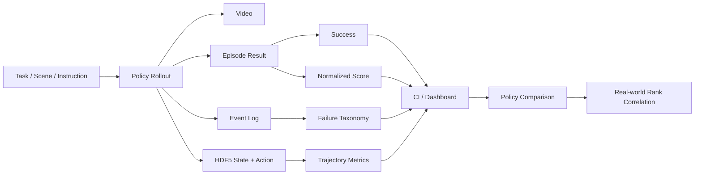

# 精讲 13-补充：评测证据链深挖，从单条 rollout 到论文结论

> **【绿色标识｜核心结论】** 原来的精讲 13 讲到了“论文还剩哪些评测侧内容”，但讲得像目录。真正需要讲深的是：RoboLab 不是用一条视频证明模型会做任务，而是用一套证据链把 `task/policy/episode/event/HDF5/dashboard/statistics` 连起来，回答“策略到底会什么、错在哪里、结论有多稳、和真实世界排序有没有关系”。

> **【蓝色标识｜源头范围】** 这章主要对应 RoboLab 论文 III-C Metrics、IV Experiments、IV-D Real-World Verification、V Limitations、Appendix A-A/A-C/A-D，以及项目文档 `docs/data.md`、`docs/event_tracking.md`、`docs/subtask.md`、`docs/dashboard.md`。论文 HTML 版本为 arXiv:2604.09860v3，日期 2026-05-14。

> **【橙色标识｜最容易踩坑】** “我看到视频成功了”只能证明那条 episode 发生过；“某任务成功率 1/1”不能证明该任务稳定；“success=False”也不能证明模型完全不会，因为 `score` 和 event log 可能显示它完成了重要子目标。

---

## 0. 这章到底补什么

前面 0-12 讲已经覆盖了生成链路、能力轴、SPARC、MNPE、prompt、solver、Gaussian。精讲 13 的深层内容不是再补一个算法，而是补一条实验逻辑：

```text
一次 policy rollout
  -> 逐步记录世界状态、动作、事件、子任务进度
  -> 得到 success / score / event counts / trajectory metrics
  -> 按任务、能力轴、难度、语言变体、扰动维度聚合
  -> 给出置信区间、对比表、复杂度曲线、真实世界排序相关性
  -> 才能说“这个策略在 RoboLab 上有什么泛化能力和失败模式”
```

如果把这条链断开，就会出现几种误读：

| 误读 | 实际应该怎么判断 |
|---|---|
| 视频里放进去了，所以模型成功 | 还要看 `episode_results.jsonl` 的 `success` 和 termination 条件 |
| `success=False`，所以完全失败 | 还要看 normalized `score`、subtask 状态和失败事件 |
| 某任务 1/1 成功，所以这个任务会了 | 单任务单 episode 只是 smoke，不是统计评测 |
| 仿真成功率高，所以真实机器人一定强 | 论文看的是与真实 benchmark 的策略排序相关性，不是逐任务等价 |
| 复杂任务失败，所以模型不会长程 | 需要区分对象识别、空间关系、可供性、动作执行、事件中断和任务结构偏差 |

---

## 1. 论文级样本单位：到底什么叫一个 episode

RoboLab 里的最小评测单位不是“任务名”，而是一条绑定了完整上下文的 episode：

```text
episode_id =
  task_id
  + scene_id
  + instruction_variant
  + policy_id
  + robot_id
  + camera_config
  + action_space_config
  + variation_seed
  + run_seed
```

说人话：  
同一个 `BananaInBowlTask`，如果换了指令说法、换了相机、换了光照、换了对象初始位姿，或者换了策略，就不是同一条评测样本。它们应该被分开记录，再按维度聚合。

### 输入输出

| 阶段 | 输入 | 输出 | 如果缺失会怎样 |
|---|---|---|---|
| 任务定义 | scene、objects、instruction、subtasks、termination | env/task config | 不知道模型被要求做什么 |
| 策略调用 | RGB、robot state、语言指令、历史动作 | action chunk / joint command / gripper command | 无法复盘策略实际看到了什么 |
| 仿真步进 | action、物理状态、相机、碰撞 | next observation、object poses、contacts | 无法判断错误来自策略还是物理 |
| 事件追踪 | world state、目标对象、接触状态 | wrong object、drop、hit table 等事件 | `False` 变成黑盒失败 |
| 结果聚合 | success、score、events、trajectory | dashboard / CSV / JSON summary | 无法形成论文表格 |

所以我们复现时保存这些文件不是“仪式感”，而是证据分工：

| 文件 | 给谁看 | 主要回答 |
|---|---|---|
| `video.mp4` / viewport 视频 | 人 | 直观看模型行为 |
| `episode_results.jsonl` | 统计脚本 | 成功率、分数、任务属性聚合 |
| `run_*.hdf5` | 深度复盘 | 图像、动作、状态、subtask 轨迹 |
| `log_*.json` / event log | 失败诊断 | 错拿、掉落、碰撞、移动、越界 |
| dashboard | 研究者/汇报 | 按能力轴、难度、语言、扰动汇总 |

---

## 2. `success` 和 `score`：不是两个名字，而是两种科学问题

论文 III-C 里的 normalized score 和 IV-B / Appendix A-C 的 score 曲线，是 RoboLab 最关键的评测设计之一。

### 2.1 `success` 问的是最终状态

```python
success = task.termination_condition(world_state)
```

它只回答：

```text
最后目标状态是否满足？
```

例如：

```text
把苹果和橙子放进碗里
```

如果苹果进了碗，橙子没进：

```text
success = False
```

这符合严格任务定义，但信息量很低。

### 2.2 `score` 问的是过程里学会了多少

一个 pick-place 子任务可以拆成并行事件或里程碑：

```text
target object identified
  -> grasped
  -> lifted / moved toward goal
  -> released near goal
  -> final relation satisfied
```

教学版可以写成：

```python
score = mean(completed_milestones(object_i) / total_milestones(object_i))
```

如果香蕉 4/4 完成，方块 1/4 完成：

```text
success = False
score = (4/4 + 1/4) / 2 = 0.625
```

这说明模型不是完全不会，它至少完成了部分对象的识别、抓取或搬运。

### 2.3 为什么 complex 任务里 `success-score gap` 特别重要

论文 Appendix A-C 强调：复杂任务 strict success 掉得很厉害，但 score 仍保留了不少部分进展。  
这句话的含义是：

```text
复杂任务失败，并不等于每个子能力都失败。
```

要把复杂任务失败拆成：

| 可能原因 | success | score | event log |
|---|---:|---:|---|
| 完全不动 | False | 接近 0 | 无有效抓取 |
| 抓对但没放准 | False | 中等 | dropped / misplaced |
| 完成一半对象 | False | 中高 | missing remaining targets |
| 做错对象 | False | 可能中等 | wrong object |
| 最终全部完成 | True | 高 | 可能仍有中途错误 |

> **【绿色标识｜核心记法】** `success` 是终局判分，`score` 是过程剖面。RoboLab 真正有分析价值的是把二者一起看。

---

## 3. Event tracking：把失败从 “False” 变成错误类型

论文 Figure 3 很重要，因为它没有只展示成功/失败，而是展示模型执行中的具体错误：

- 过早松手，目标没进容器。
- 抓了错误对象。
- 先重定向了无关对象。
- 多次尝试错误对象。

RoboLab 的 event tracking 逻辑就是把这些可观察行为变成可统计事件。

### 3.1 事件检测需要什么输入

```text
world_state:
  object poses
  object velocities
  object semantic labels
  gripper pose
  gripper contact
  target object set
  workspace bounds
```

事件不是凭视频主观判断，而是从状态变化里推出来：

```text
gripper contacts non-target object
  -> WRONG_OBJECT_GRABBED

target object z suddenly decreases after grasp
  -> TARGET_OBJECT_DROPPED

gripper collision with table while moving
  -> GRIPPER_HIT_TABLE

object pose changes beyond threshold without being intended
  -> OBJECT_MOVED

object leaves workspace bounds
  -> OBJECT_OUT_OF_SCENE
```

### 3.2 事件日志怎么用于诊断

| 事件模式 | 更可能说明什么 | 后续该看什么 |
|---|---|---|
| wrong object 很多 | 视觉/语义/语言绑定失败 | object labels、camera view、instruction specificity |
| dropped target 很多 | 抓取、gripper 后处理、释放时机失败 | action chunk、gripper threshold、EEF trajectory |
| hit table 很多 | 运动轨迹不合理或相机/动作尺度错 | SPARC、speed、joint limits、控制频率 |
| object moved/tipped 很多 | 物理接触或场景拥挤 | asset collision、mass/friction、initial placement |
| out of scene | 策略失控或物理异常 | safety bounds、action clipping、policy server output |

### 3.3 视频和 event log 的分工

视频适合做定性解释，比如“模型看起来犹豫”。  
event log 适合做统计判断，比如“错误对象抓取率在 vague instruction 下上升”。

真正的评测汇报应该同时有：

```text
视频截图/片段
  + event counts
  + success/score
  + 轨迹质量
  + 任务属性
```

---

## 4. Instruction variation：语言泛化不是换一句话那么简单

RoboLab 的 language variation 不只是 prompt 多样化，它是在测试模型是否把语言映射到目标状态。

### 4.1 三种指令的含义

| 指令类型 | 例子 | 模型需要做什么 |
|---|---|---|
| specific | Put the yellow banana into the bowl | 绑定显式属性和对象 |
| default | Put the banana into the bowl | 按常规对象名执行 |
| vague | Put the fruit into the bowl | 从类别/上下文推断目标集合 |

vague 难在哪里？

```text
语言没有直接给对象实例名
  -> 模型要识别类别
  -> 在场景中绑定正确对象
  -> 排除无关但相似对象
  -> 执行目标关系
```

### 4.2 为什么语言变体要和事件日志一起看

只看 success：

```text
vague success rate 下降
```

你不知道原因。  
结合 event log 后，可以拆成：

| 下降原因 | 可观察信号 |
|---|---|
| 不知道 “fruit” 指哪些对象 | wrong object / no grasp |
| 目标集合不完整 | partial score 高但 success 低 |
| 抓对但放错 | target dropped / wrong relation |
| 指令过长导致动作延迟 | timeout / low progress |

这就是为什么 notebook 后续如果要做论文级复现，不能只固定 default instruction。

---

## 5. Complexity sweep：三条压力轴怎么读

论文 IV-B 里的 complexity sweep 包含：

```text
instruction specificity
scene complexity
task horizon
```

它们不是新的能力轴，而是压力测试轴。

### 5.1 instruction specificity

考的是语言绑定：

```text
specific -> default -> vague
```

如果 vague 下降明显，说明模型可能依赖模板语言，而不是真正形成目标状态。

### 5.2 scene complexity

考的是视觉 clutter 和目标选择：

```text
visible objects 少
  -> 目标更显眼
visible objects 多
  -> 干扰物更多
  -> 错拿概率上升
```

这里最好配合：

```text
wrong_object count
target_object_visibility
camera pose
object semantic category
```

否则“复杂场景失败”仍然太粗。

### 5.3 task horizon

考的是多步骤持续执行：

```text
subtask_count 增加
  -> 每一步都可能失败
  -> 累积失败概率上升
```

如果每个子任务成功概率是 `p`，粗略地：

```text
full_success ≈ p^N
```

当 `p=0.8`：

| 子任务数 | 理想化 full success |
|---:|---:|
| 1 | 0.80 |
| 3 | 0.512 |
| 5 | 0.328 |
| 7 | 0.210 |

这说明长任务成功率低不一定意味着“长程推理全错”，也可能是每一步都有小概率执行误差，最后连乘放大。

### 5.4 为什么 Appendix A-D 要提醒 “subtask=7 异常”

论文指出某个 7-subtask bin 有成功率回升，但原因可能是该 bin 被结构简单、重复 pick-place 的任务主导。  
这提醒我们：

```text
task horizon 数字本身不等于因果长程推理难度。
```

真正难的是：

- 后一步依赖前一步结果。
- 目标状态会改变可供性。
- 对象之间有空间/容器/堆叠约束。
- 错一步会导致后面无解。

---

## 6. 统计置信：为什么 10 episode 仍然很粗

论文 Appendix A-A 说得很明确：因为仿真和策略都有随机性，每个 task/policy 要跑多 episode。论文 benchmark 每个任务是 `N=10`，但作者也提醒，单任务层面的置信区间仍然很宽。

### 6.1 二项成功率的直觉

如果某任务 10 次里成功 5 次：

```text
success_rate = 50%
```

但这不代表真实成功概率精确等于 50%。因为样本太少，95% 区间会很宽。

论文给出的直觉是：

```text
N=10 时，p≈0.5 附近单任务 95% CI 半宽约 30%
N=100 时，p≈0.5 附近半宽约 10%
```

说人话：

> 10 次评测适合看总体趋势，不适合对单个任务做很细的强结论。1 次评测只适合 smoke。

### 6.2 为什么 aggregate 更可信

RoboLab-120 聚合时，有很多任务和 episode：

```text
effective_samples = tasks * episodes_per_task
```

总体 success rate / score 会比单任务更稳定。  
但这也有代价：聚合会掩盖特定类别的失败。

所以论文同时看：

```text
overall
  + difficulty
  + competency axis
  + task category
  + instruction specificity
  + scene complexity
  + task horizon
```

---

## 7. Dashboard：不是展示页，而是评测数据库视图

RoboLab dashboard 的价值不是“好看”，而是把底层证据按研究问题切开。

### 7.1 Dashboard 应该服务的问题

| 问题 | 应该聚合什么 |
|---|---|
| 哪个策略总体最强 | policy -> success/score |
| 哪类任务最难 | task category / competency axis |
| 是否只会简单任务 | difficulty level |
| 是否语言泛化差 | instruction type |
| 是否看错对象 | wrong object counts |
| 是否动作轨迹差 | SPARC / speed |
| 是否对扰动敏感 | camera / lighting / object pose variation |

### 7.2 为什么 dashboard 要接 HDF5 和 JSON

`episode_results.jsonl` 适合聚合。  
HDF5 适合深挖单条轨迹。

理想 workflow：

```text
dashboard 发现：某策略 spatial tasks score 低
  -> 筛出失败 episode
  -> 看 event counts：wrong object 还是 dropped target
  -> 打开 HDF5/video：看失败发生在哪一步
  -> 回到 task metadata：看是不是对象/关系/视角导致
```

这才是 RoboLab 比“只给 success table”更有价值的地方。

---

## 8. Real-world verification：相关性到底说明什么

论文 IV-D 把 RoboLab 结果和 RoboArena 真实世界评测做比较。这里非常容易误读。

### 8.1 它不是说仿真分数等于真实分数

两个 benchmark 的输出不是同一种东西：

```text
RoboLab: success rate / score in simulation
RoboArena: real-world pairwise ranking / Elo
```

所以比较重点不是数值相等，而是排序是否一致：

```text
policy A > policy B > policy C
```

这就是为什么 rank correlation 比直接比较分数更合理。

### 8.2 它能支持什么结论

可以支持：

```text
RoboLab 在一定策略集合上能给出和真实评测相近的排序信号。
```

不能支持：

```text
RoboLab 每个任务都等价于真实世界。
RoboLab success rate 可以直接换算成真实成功率。
RoboLab 覆盖所有真实机器人失败模式。
```

### 8.3 我们复现时怎么用这个结论

我们当前单任务 Pi05 成功不能用来证明真实相关性。  
但它可以作为第一步：

```text
先证明 pipeline 能跑通
  -> 再跑多个任务/策略
  -> 再比较策略排序
  -> 最后才谈 proxy validity
```

---

## 9. Limitations：哪些失败不应该强行归因给策略

论文 V Limitations 说明 RoboLab 当前主要面向 rigid-body tabletop manipulation。这个边界必须写进复现报告。

### 9.1 当前擅长的问题

- 桌面刚体对象。
- pick-place、containment、stacking、reorientation。
- 视觉属性：颜色、语义、尺寸。
- 空间关系：left/right/inside/on/near 等。
- 程序能力：可供性、重定向、堆叠。

### 9.2 当前不充分覆盖的问题

- deformable objects：布料、线缆、袋子。
- contact-rich skills：插拔、旋拧、精细力控。
- open-ended household chores：例如 “整理房间”。
- 强因果长程任务：后一步依赖前一步创造的状态。
- 真实机器人中的硬件误差、传感器噪声、网络延迟、控制器差异。

### 9.3 失败归因表

| 现象 | 首先归因 | 下一步检查 |
|---|---|---|
| Isaac 启动失败 | 环境/依赖 | driver、Isaac Sim、assets、headless |
| LFS 指针导致找不到 USD | 资产下载 | git-lfs、asset path、文件大小 |
| 空动作也能初始化 | 环境 smoke 成功 | 不能算策略成功 |
| Pi05 抓错对象 | 策略视觉/语义泛化 | event wrong object、camera view |
| Pi05 抓对但掉落 | 控制/抓取/动作后处理 | gripper、action chunk、release timing |
| 任务需要布料/线缆 | benchmark 边界 | 不应拿 RoboLab 当前结果过度外推 |
| 只有 1 条成功视频 | 证据规模不足 | 增加 episode、做 CI |

---

## 10. 给 4090 复现的实际实验矩阵

4090 不适合一上来跑完整 RoboLab-120，但可以做一个低成本、论文口径更接近的小矩阵。

### 10.1 第一版：12-task subset

| 类别 | 任务数 | 每任务 episode | 目标 |
|---|---:|---:|---|
| visual | 4 | 3 | 颜色/语义/尺寸 |
| relational | 4 | 3 | 空间关系/计数/连接词 |
| procedural | 4 | 3 | 可供性/重定向/堆叠 |

总量：

```text
12 tasks * 3 episodes = 36 episodes
```

这比 1 条视频可靠很多，但还不是论文完整结果。

### 10.2 第二版：语言变体矩阵

选 3 个任务：

```text
default / vague / specific
```

每种 3 episodes：

```text
3 tasks * 3 variants * 3 episodes = 27 episodes
```

看：

- success_by_instruction_type
- score_by_instruction_type
- wrong_object_by_instruction_type

### 10.3 第三版：扰动小矩阵

选 2 个任务，做：

```text
camera pose: baseline / mild / strong
lighting: baseline / dark / bright
object pose: baseline / shifted / cluttered
```

这里重点不是跑很多，而是给 MNPE / sensitivity analysis 准备结构化输入。

---

## 11. 复现报告应该怎么写才不虚

一个合格的 RoboLab 复现报告应该避免写：

```text
模型成功完成了 RoboLab。
```

应该写成：

```text
在 RTX 4090 上，我们完成了 Pi05 + RoboLab 的单任务闭环。
BananaInBowlTask: success=True, score=1.0, step=198。
另抽样 3 个复杂任务，1 成功 2 失败。
这些结果证明 policy server、Isaac runtime、task loading、video/HDF5/event logging 链路可用。
它仍然不是 RoboLab-120 完整复现，也不足以做论文级统计结论。
```

如果要写“模型哪里弱”，至少要补：

```text
任务属性
instruction type
success
score
event counts
失败视频
HDF5/JSON 证据路径
```

---

## 12. 一句话总图



记住这条链：

```text
视频是证据入口，不是结论本身。
success 是终局，score 是过程，event 是错因，CI 是可信度，rank correlation 是和真实世界的连接。
```

---

## 13. 这章对应到我们已经产出的文件

| 复现文件 | 对应这章哪一块 |
|---|---|
| `COMPLETE_REPRO_pi05_banana_20260620.md` | 单任务闭环证据，但不是统计结论 |
| `COMPLEX_TASKS_pi05_20260620.md` | 复杂任务抽样，适合接 score/event 解释 |
| `robolab_repro_artifacts/repro_status.json` | 复现门禁状态 |
| `robolab_repro_artifacts/pi05_policy_smoke_summary.json` | policy smoke 摘要 |
| `robolab_repro_artifacts/task_summary.csv` | 任务结果表 |
| `RoboLab_4090_repro_learning_record.ipynb` | 把论文、代码和复现证据串起来 |

后续如果要把这章真正落地，应该新增一个自动报告：

```text
episode_results.jsonl
  + event logs
  + task metadata
  + video paths
  -> failure_report.md
```

每条失败自动输出：

```text
任务名
能力轴
语言变体
success / score
失败事件 Top-K
对应视频
可能归因
下一步实验
```

这会把 RoboLab 从“跑出来了”推进到“可以分析策略能力”。

