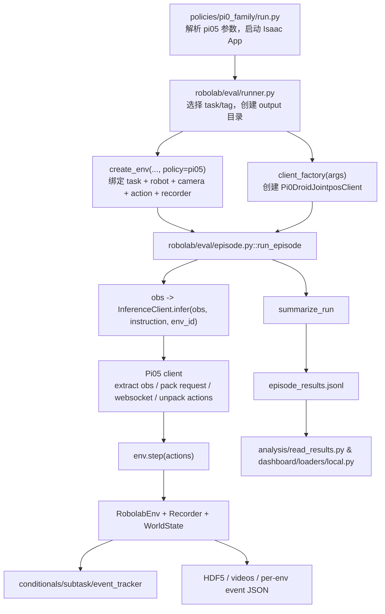

# 精讲 14：还没讲透的核心代码 - policy rollout 到证据链

<!-- FINAL-20260621-UPDATE:BEGIN -->

> [!TIP]
> **2026-06-21 复现实证更新**：`runner -> episode -> policy client -> recorder -> summarize -> analysis/read_results.py` 这条链已经在 Pi05 full-120 上跑通，并发现/修复了本地 `analysis/check_results.py` 的 `hdf5_path` 未定义问题。

<!-- FINAL-20260621-UPDATE:END -->


> **【绿色标识｜核心结论】** 前面讲了很多“任务怎么生成、成功怎么定义、论文怎么评测”。但真正复现时最常出问题的是另一条链路：`runner.py` 选任务和创建输出目录，`episode.py` 每一步调用 policy，再 `env.step`，`InferenceClient` 把观测转成模型请求，`WorldState/conditionals/EventTracker` 判断发生了什么，`RecorderManager/summarize/results/dashboard` 把过程写成 HDF5、JSON、视频和表格。
>
> **【蓝色标识｜源码路径】** 这节基于远端 4090 源码快照 `7d45d74904eade3b578a8eb1f2f9f89bc3d40326`：`robolab/eval/runner.py`、`robolab/eval/episode.py`、`robolab/eval/base_client.py`、`policies/pi0_family/client.py`、`robolab/eval/summarize.py`、`robolab/core/world/world_state.py`、`robolab/core/task/event_tracker.py`、`robolab/core/logging/recorder_manager.py`、`robolab/core/logging/results.py`、`dashboard/loaders/local.py`。
>
> **【橙色标识｜容易误解】** `policies/pi0_family/run.py` 不是“模型本体”。它只是 RoboLab 侧的 runner/client；OpenPI 模型通常在另一个 server 进程里，RoboLab 通过 websocket 请求动作。

## 先说还缺哪块代码

前面精讲已经覆盖：

- Task 定义：scene、instruction、termination、subtasks。
- Scene/Task generation：prompt、solver、physical placement、validation。
- Metrics：SPARC、MNPE、difficulty、DTGE。
- Evidence interpretation：success/score、event、CI、真实世界相关性。

但还没系统讲透：

```text
一个 policy-controlled episode 到底怎么跑起来？
观测怎么进模型？
动作怎么回到仿真？
多 env 并行时怎么避免串动作？
视频/HDF5/JSON/event log 是谁写的？
dashboard 为什么能读到结果？
```

这就是本节要补的核心代码。

## 1. 总调用链

把真实 policy eval 压成一张图：



说人话：

> `runner.py` 管“跑哪些题”，`episode.py` 管“每一步怎么推进”，`client.py` 管“怎么问模型要动作”，`WorldState/conditionals/event_tracker` 管“发生了什么”，`recorder/summarize/results/dashboard` 管“证据怎么落盘和展示”。

## 2. `runner.py`：不是跑一步，而是跑整场考试

核心函数：

```text
add_common_eval_args(parser)
run_evaluation(args, policy, client_factory)
```

### 输入

- `--task` / `--tag` / 默认全任务。
- `--num-envs`：并行环境数。
- `--num-runs`：每个 task 顺序跑几批。
- `--instruction-type`：`default/vague/specific` 等语言变体。
- `--enable-subtask`：是否记录 subtask 进度。
- `--video-mode`：保存 sensor/viewport 视频。
- `--output-folder-name`：指定旧目录可续跑。
- `--num-episodes-adaptive` 与 `--ci-pp-width`：按成功率置信区间自适应补 episode。

### 输出

```text
output/<timestamp>_<policy>/
  episode_results.jsonl
  <TaskName>/
    env_cfg.json
    run_0.hdf5
    log_0_env0.json
    *.mp4
```

### 代码关键点

`run_evaluation()` 做这几件事：

1. 根据 `policy` 和时间戳创建输出目录。
2. 根据 `task/tag` 找任务列表。
3. 调 `init_experiment()` 创建或加载 `episode_results.jsonl`。
4. 每个 task 调 `create_env()`。
5. 每个 task 创建一次 policy client。
6. 每个 run 调 `run_episode()`。
7. 调 `summarize_run()` 把这批结果追加到 JSONL。
8. 最后 `summarize_experiment_results()` 打印总表。

**【绿色标识｜调试直觉】**

如果你发现某个任务没跑，先看 `runner.py` 这一层：是不是 `--task/--tag` 筛选错了？是不是 `episode_results.jsonl` 里已经有记录导致续跑跳过？是不是 `num_envs` 过大 OOM？

## 3. `episode.py`：真正的闭环在这里

核心函数：

```text
run_episode(env, env_cfg, episode, client, headless, save_videos, video_mode)
```

### 每一步做什么

```text
reset env
setup HDF5 file and video writers
for step in max_steps:
    for each active env:
        action = client.infer(obs, instruction, env_id)
    obs, reward, term, trunc, info = env.step(actions)
    subtask_status.append(get_all_env_subtask_infos(env))
    write video frames
    if env.all_terminated:
        break
release videos
client.reset()
return env_results, subtask_status, timing
```

### 关键设计

| 设计 | 作用 |
|---|---|
| `clients = [client] * env.num_envs` | 同一个连接服务多个并行环境 |
| `env.active_env_ids` | 只给未终止 env 请求动作 |
| frozen env action 为 0 | 已结束的环境不再继续污染轨迹 |
| `set_hdf5_file(f"run_{episode}.hdf5")` | 每个 run 一个 HDF5 |
| `set_episode_index(env_id)` | HDF5 里用 `demo_<env_id>` 对齐并行 env |
| `TimingStats` | 分开记录 policy/env/video 的耗时 |
| `client.reset()` | 清空 action chunk，避免下一 episode 执行旧动作 |

**【橙色标识｜常见坑】**

如果 OpenPI 一次返回 15 步 action chunk，`client.infer()` 不是每个 sim step 都真的请求 server。它会先消费缓存动作，缓存耗尽后才重新发 websocket 请求。所以平均 inference time 和 sim step 数不是一回事。

## 4. `InferenceClient`：所有策略接入的最小合同

抽象类在：

```text
robolab/eval/base_client.py
```

它要求策略实现 4 个 hook：

| hook | 输入 | 输出 | 职责 |
|---|---|---|---|
| `_extract_observation(raw_obs, env_id)` | RoboLab 原始 obs | flat numpy dict | 从 batched tensor 里取一个 env 的图像/关节 |
| `_pack_request(extracted_obs, instruction)` | flat obs + 语言 | server request | 改成模型服务端需要的 key/schema |
| `_query_server(request)` | request | response | 请求模型服务 |
| `_unpack_response(response)` | response | action chunk | 拿出动作数组 |

父类 `infer()` 把它们串起来：

```text
extract -> needs_refresh? -> pack -> query -> unpack -> postprocess -> cache -> next_action
```

### 为什么这层很关键

RoboLab 支持不同 policy，不可能把 Pi0/Pi05/GR00T/ReKep 全写死在 evaluator 里。  
所以它只要求每个 policy 提供同一个接口：

```text
obs + instruction -> action
```

这也是我们以后接 RoboChallenge 或 ReKep 的入口。

## 5. `Pi0DroidJointposClient`：OpenPI/Pi05 的适配层

文件：

```text
policies/pi0_family/client.py
```

它做的事情很具体：

### 输入

来自 RoboLab 的 observation：

```text
raw_obs["image_obs"]["over_shoulder_left_camera"][env_id]
raw_obs["image_obs"]["wrist_cam"][env_id]
raw_obs["proprio_obs"]["arm_joint_pos"][env_id]
raw_obs["proprio_obs"]["gripper_pos"][env_id]
```

### 发给 OpenPI 的 request

```text
observation/exterior_image_1_left
observation/wrist_image_left
observation/joint_position
observation/gripper_position
prompt
```

注意这些 key 不是随便起的，它们要匹配 DROID checkpoint 的训练 schema。

### 输出

OpenPI server 返回：

```text
response["actions"] -> numpy action chunk
```

Pi05 默认 `open_loop_horizon = 15`。  
最后一维 gripper 会二值化：

```text
chunk[..., -1] = chunk[..., -1] > 0.5
```

说人话：

> 这层是“翻译官”：RoboLab 的观察格式翻译成 OpenPI 听得懂的请求，再把 OpenPI 的动作翻译回 RoboLab action space。

## 6. `RobolabEnv.step` 与 frozen env：为什么并行评测不会乱

文件：

```text
robolab/core/environments/env.py
```

前面精讲没有深入这块。它的关键是：评测和 RL 训练不一样。

训练时一个 env 结束可以立刻 reset。  
评测时不能这么做，因为我们还要：

- 知道它在哪一步成功/失败。
- 导出这一条 episode 的 HDF5。
- 写事件日志。
- 不让已结束 env 继续接收动作。

所以 RoboLab 用：

```text
active_env_ids
_frozen_envs
all_terminated
reset_eval_state()
```

来管理并行环境。  
这就是为什么 `episode.py` 每步只对 `active_env_ids` 请求动作。

## 7. `WorldState`：谓词函数不直接到处翻 Isaac 数据

文件：

```text
robolab/core/world/world_state.py
```

它是仿真查询统一入口，提供：

- entities / objects / articulations / extras。
- pose、velocity、frame pose。
- dimensions、AABB、bbox、centroid。
- robot joint state。
- contact force / in contact。

### 为什么要有这一层

如果 `object_in_container()`、`object_left_of()`、`object_grabbed()` 每个函数都自己读 Isaac/Usd/ContactSensor，代码会非常乱，也很难批量处理 `num_envs`。

`WorldState` 把这些统一起来：

```text
conditionals.py -> get_world(env) -> geometry/contact/pose query
```

### 两个重要缓存

| 缓存 | 用途 |
|---|---|
| `_local_geometry_cache` | 本地 bbox/dimensions 静态不变，避免每 step 重算 USD 几何 |
| `_predicate_state` | 顺序谓词需要跨 step 记忆，例如先后关系、是否曾经放入过 |

**【绿色标识｜调试直觉】**

如果视频里对象看起来已经进碗，但 `success=False`，重点查 `WorldState` + `conditionals.py`：bbox、contact、tolerance、gripper detached、container relation 是否和肉眼判断一致。

## 8. `EventTracker`：失败不是一个 False，而是一串行为事件

文件：

```text
robolab/core/task/event_tracker.py
```

它追踪：

- wrong object grabbed。
- gripper hit table。
- gripper fully closed but no grasp。
- non-target object moved/bumped。
- object out of scene。
- object tipped over。
- target object dropped。
- gripper hit non-target object。
- multiple objects grabbed。

### 输入

```text
env
per_env_intended target object set
frozen_mask
ignore_objects
upright_objects
```

### 输出

```text
[(info_string, StatusCode, env_mask), ...]
```

`env_mask` 很重要：它告诉你这个事件发生在哪些并行 env 上。

说人话：

> `EventTracker` 是失败诊断器。它让我们知道模型是没动、抓错、撞桌、提前放手，还是把无关物体撞飞。

## 9. `RobolabRecorderManager`：HDF5 为什么能撑长 episode

文件：

```text
robolab/core/logging/recorder_manager.py
```

它扩展 Isaac Lab 的 recorder，重点是：

- 每个 env 有独立 `EpisodeData`。
- 每个 run 可以切换到 `run_<idx>.hdf5`。
- 每个 env 可以写到 `demo_<env_id>`。
- 长 episode 支持 streaming flush，降低内存压力。
- 已结束 env 可以单独导出。

这解释了为什么结果结构通常是：

```text
TaskName/
  run_0.hdf5
    /data/demo_0/...
    /data/demo_1/...
  log_0_env0.json
  log_0_env1.json
```

**【橙色标识｜常见坑】**

如果 HDF5 为空，不一定是 policy 没跑；也可能是 recorder 没初始化、没有调用 `set_hdf5_file`、env 没成功 export、或者 episode 在导出前异常退出。

## 10. `summarize_run` 与 `results.py`：把过程折叠成一行 JSONL

文件：

```text
robolab/eval/summarize.py
robolab/core/logging/results.py
```

`run_episode()` 返回的是过程数据；论文表格需要的是 episode 级摘要。  
`summarize_run()` 做折叠：

1. 读取 final subtask info。
2. 找到 `run_<idx>.hdf5`。
3. 从 recorder 取出 per-env events。
4. 写 `log_<run>_env<id>.json`。
5. 从 HDF5 读 `demo_<env_id>`。
6. 计算 trajectory metrics。
7. 读取 final score。
8. build `run_summary`。
9. `update_experiment_results()` append 到 `episode_results.jsonl`。

`episode_results.jsonl` 是后续 analysis/dashboard 的主账本。  
没有它，视频和 HDF5 仍然有价值，但论文级聚合会断。

## 11. `dashboard/loaders/local.py`：结果为什么能在网页里看

Dashboard 不重新跑 Isaac，也不 import 任务代码。它读文件：

```text
episode_results.jsonl
task folder
HDF5
videos
event logs
```

核心设计：

- `episode_results.jsonl` 是 canonical source。
- HDF5 是否有 episode 用轻量检查。
- loader 用 mtime 做 cache key，文件变了就刷新。
- success rate 用 Beta credible interval。
- score 用 Student-t CI。

说人话：

> Dashboard 是离线证据查看器，不是仿真运行器。它的可靠性取决于前面 runner/summarize 是否把证据写完整。

## 12. 按故障反查代码

| 现象 | 优先看哪里 | 原因 |
---|---|---|
| 命令启动后没跑目标任务 | `runner.py` task/tag 筛选、续跑跳过 | 任务列表或 JSONL 已有记录 |
| OpenPI server 已开但动作不对 | `Pi0DroidJointposClient._pack_request` | key/schema/image resize/语言 prompt 不匹配 |
| 多 env 行为串了 | `InferenceClient._chunks/_counters` 是否按 `env_id` 分开 | action chunk 缓存污染 |
| 视频里成功但 `success=False` | `conditionals.py` + `WorldState` | contact/tolerance/detached/bbox 判断和肉眼不同 |
| 错误原因为空 | `EventTracker` + recorder event export | event 没触发或没写入 per-env log |
| HDF5 空 | `RobolabRecorderManager` | file handler、episode index、export 时机 |
| JSONL 没新增 | `summarize_run` + `update_experiment_results` | episode summary 没 build 或 append |
| Dashboard 看不到结果 | `dashboard/loaders/local.py` | 路径、mtime cache、缺 JSONL/HDF5/videos |

## 13. 复现时最重要的代码心智模型

记住下面这个分层：

```text
runner:        选任务、建输出目录、续跑、批量调度
episode:       每一步 obs -> client -> action -> env.step
client:        把 RoboLab obs 翻译成 policy server 请求
env/world:     仿真状态、几何、接触、成功条件
event:         把失败拆成可解释事件
recorder:      写 HDF5 和视频
summarize:     折叠成 episode_results.jsonl
dashboard:     离线读取证据并展示统计
```

如果后续你要接 RoboChallenge 的 pi 或 ReKep，最该改的是：

- policy client：观测 schema、动作 schema、连接方式。
- runner 参数：policy 名称、模型服务地址、任务子集。
- 结果分析：同一套 `episode_results.jsonl` 聚合，不要改掉主证据格式。

## 小结

精讲14补的是代码运行主干：

```text
任务不是直接被模型解决的。
任务先被 runner 选中，
被 create_env 装成可运行环境，
被 episode loop 按 step 推进，
被 client 转成模型请求，
被 WorldState/conditionals/event 判断行为，
被 recorder/summarize 写成证据，
最后才被 analysis/dashboard 变成论文表格。
```

这条链路比单个模型调用更重要。因为复现失败时，问题可能在模型、观测、动作、仿真、谓词、记录、汇总、展示任意一层。
