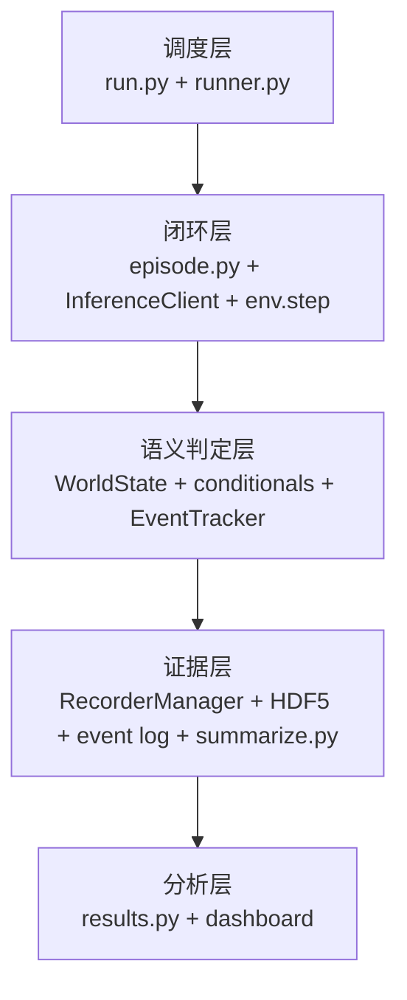
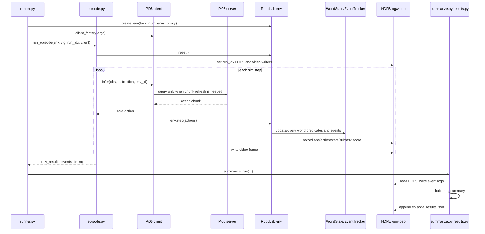

# 精讲 14-补充：核心运行时代码深挖，policy rollout 如何变成证据

> <span style="color:#166534"><strong>[绿色 核心结论]</strong></span>：RoboLab 的核心代码不是一个“跑模型”的脚本，而是一条可审计的评测流水线。`runner.py` 负责选择任务和组织实验，`episode.py` 负责把策略放进仿真闭环，`InferenceClient` 和 Pi05 client 负责把观测转成模型请求，`WorldState` 和 `EventTracker` 负责解释场景中发生了什么，`RecorderManager`、`summarize.py`、`results.py` 和 dashboard 负责把过程落成 HDF5、JSONL、事件日志、视频和统计表。

> <span style="color:#1d4ed8"><strong>[蓝色 源码路径]</strong></span>：本节基于官方 RoboLab GitHub 主干源码讲解，重点对应 `robolab/eval/runner.py`、`robolab/eval/episode.py`、`robolab/eval/base_client.py`、`policies/pi0_family/client.py`、`robolab/core/world/world_state.py`、`robolab/core/task/event_tracker.py`、`robolab/eval/summarize.py`、`robolab/core/logging/results.py`、`robolab/core/logging/recorder_manager.py`、`dashboard/loaders/local.py`。

> <span style="color:#b45309"><strong>[橙色 易错点]</strong></span>：不要把“有视频”误认为“复现成功”。视频只是观测证据之一。真正的评测结果要看 `episode_results.jsonl`、每个 env 的事件日志、HDF5 里的 subtask score、成功标志、失败原因和统计置信区间。

## 0. 为什么原来的精讲 14 还不够

原来的精讲 14 已经把主文件列出来了，但还停留在“这个文件负责什么”的层面。实际复现时，问题通常不会问得这么抽象，而是会变成这些具体问题：

- 为什么我看到机械臂动了，但是 `success=false`？
- 为什么 Pi05 server 明明在跑，但 RoboLab 一直等待或动作不对？
- 为什么多 env 并行时一个 env 成功了，另一个 env 的视频和日志像是串了？
- 为什么 dashboard 里没有视频，或者有视频却没有 score？
- 为什么同一个任务跑过一次后，再跑会被跳过？
- 4090 显存不够时，到底该降 `num_envs` 还是降任务数量？

这些问题都要沿着运行时代码链去查。下面按“输入、处理、输出、常见故障”的方式拆。

## 1. 总体心智模型：三层闭环



说人话：

- 调度层决定“考哪几道题、跑几遍、结果放哪”。
- 闭环层决定“每一个仿真 step 里，模型看什么、输出什么动作、环境怎么更新”。
- 语义判定层决定“苹果是否真的进碗、是否抓错物体、是否撞桌、是否把无关物体撞飞”。
- 证据层决定“这些过程证据怎么保存，最终成功率、score 和失败原因怎么生成”。
- 分析层决定“复现报告、dashboard、表格、对比图怎么读这些结果”。

关键是：RoboLab 的评测不是只保存最后一帧，而是把一条 episode 的动作、观测、子任务状态、失败事件和统计结果都拆开保存。

## 2. `runner.py`：考试组织者，不直接控制机械臂

### 2.1 输入是什么

`runner.py` 接收的不是传感器观测，而是评测参数：

| 参数 | 作用 | 复现时的判断 |
|---|---|---|
| `--task` | 指定一个或多个任务名 | 最适合单任务调试 |
| `--tag` | 按能力标签筛任务 | 适合视觉、关系、程序能力子集评测 |
| `--num-envs` | 并行环境数 | 4090 上通常先从 1 开始 |
| `--num-runs` | 每个 task 顺序跑几批 | 每批包含 `num_envs` 个 episode |
| `--instruction-type` | 默认、模糊、具体等指令变体 | 用来测语言鲁棒性 |
| `--video-mode` | 保存 sensor、viewport、all 或 none | 调试阶段建议 all，批量评测可关视频 |
| `--output-folder-name` | 指向已有输出目录 | 用于续跑或复查旧结果 |
| `--num-episodes-adaptive` | 自适应采样上限 | 用成功率置信区间控制样本量 |

### 2.2 它为什么要延迟导入 Isaac 相关模块

源码里有一个很实际的设计：公共参数解析必须在 Isaac AppLauncher 启动前完成，但很多 Isaac Lab、environment、episode 相关模块只能在仿真 app 初始化后安全导入。所以 `add_common_eval_args()` 很轻，`run_evaluation()` 里面才导入重模块。

<span style="color:#166534"><strong>[绿色 核心结论]</strong></span>：这解释了为什么 `runner.py` 看起来像普通 Python 脚本，但不能像普通库一样随便导入全部依赖。Isaac Sim 的生命周期会影响 import 顺序。

### 2.3 它的主要处理流程

简化成伪代码：

```python
output_dir = make_output_dir(timestamp, policy, instruction_type)
task_envs = get_envs(task=args.task or tag=args.tag or all)
episode_results = init_or_load_episode_results(output_dir)

for task_env in task_envs:
    if task_already_complete(task_env):
        continue
    env, env_cfg = create_env(task_env, policy=policy, num_envs=args.num_envs)
    client = client_factory(args)
    for run_idx in runs_or_adaptive_loop:
        if run_already_complete(task_env, run_idx):
            continue
        env_results, events, timing = run_episode(env, env_cfg, run_idx, client)
        episode_results = summarize_run(...)
        env.reset_eval_state()
    env.close()
summarize_experiment_results(episode_results)
```

### 2.4 输出是什么

`runner.py` 本身不产出动作，它产出一个实验目录结构：

```text
output/<timestamp>_<policy>[_instruction_type]/
  episode_results.jsonl
  <TaskName>/
    run_0.hdf5
    log_0_env0.json
    <instruction>_0.mp4
    <instruction>_0_viewport.mp4
    env_cfg.json
```

### 2.5 常见问题怎么定位

| 现象 | 优先查 |
|---|---|
| 任务没有跑 | `--task` 名称、`--tag` 过滤、任务注册是否存在 |
| 直接显示 skipped | `episode_results.jsonl` 里可能已有同 task/episode 记录 |
| 输出目录不是预期目录 | `--output-folder-name`、policy 名、instruction type |
| 4090 OOM | 先把 `--num-envs` 降到 1，不要先盲目改模型 |
| 批量评测太慢 | 关视频、缩小 task 子集、只跑目标能力轴 |

## 3. `episode.py`：真正的 step 闭环在这里

`episode.py::run_episode()` 是最核心的动态执行函数。它把 policy、env、recorder、video writer 串起来。

### 3.1 输入是什么

| 输入 | 含义 |
|---|---|
| `env` | RoboLab/Isaac Lab 环境，里面有机器人、物体、相机、action space |
| `env_cfg` | 任务配置，包含 instruction、sim dt、render interval、decimation 等 |
| `episode` | run index，用来命名 `run_<idx>.hdf5` |
| `client` | 一个 `InferenceClient` 子类，比如 Pi05 client |
| `headless` | 是否显示窗口 |
| `save_videos` 和 `video_mode` | 是否保存 sensor/viewport 视频 |

### 3.2 单步循环到底做了什么

```text
reset env
设置 run_<idx>.hdf5
设置每个 env 的 demo_<env_id>
设置视频 writer

for step in max_steps:
    等 Isaac timeline 播放
    给 active env 请求动作
    拼成 actions tensor
    env.step(actions)
    读取 subtask info
    写视频帧
    如果所有 env 都结束，break

释放视频 writer
client.reset()
return env_results, subtask_status, timing
```

### 3.3 为什么 action 要先建全零 tensor

多 env 并行时，不是每个 env 都还活着。已经结束的 env 会 frozen。`episode.py` 先建一个形状为 `(num_envs, action_dim)` 的零 action tensor，只给 `env.active_env_ids` 填模型动作。

这有两个好处：

- 已结束的 env 不再继续污染轨迹。
- `env.step(actions)` 仍然能拿到固定形状的 batched action。

<span style="color:#b45309"><strong>[橙色 易错点]</strong></span>：如果你看到一个 env 成功后视频停止更新，这是正常的 frozen 行为。不要把“某个 env 不再写视频帧”误判成 video writer 崩了。

### 3.4 `action_dim` 为什么从 action manager 取

Isaac Lab 环境里 action space 可能经过 action manager 管理，最终控制维度不一定只看 Gym action space。代码优先读 `env.action_manager.total_action_dim`，没有才 fallback 到 `env.action_space.shape[-1]`。

这对接新策略很重要：

- 如果策略输出维度少了，`actions[env_id] = ...` 会报 shape 错。
- 如果策略输出维度多了，可能被截断前就失败。
- 如果 gripper 维度约定不一致，机械臂会出现“轨迹对但夹爪反”的现象。

### 3.5 `client.reset()` 为什么必须在 finally 里

Pi05 这类策略通常返回 action chunk，例如一次返回 15 步。`InferenceClient` 会缓存 chunk 并逐步消费。如果 episode 结束后不 reset，下一个 episode 可能从旧 chunk 中继续拿动作。

<span style="color:#166534"><strong>[绿色 核心结论]</strong></span>：episode 边界不仅是仿真环境 reset，也是 policy client 的状态边界。

## 4. `InferenceClient`：所有策略接入的最小合同

`InferenceClient` 是 RoboLab policy adapter 的关键抽象。它不是模型本体，而是“仿真观测和策略服务之间的合同”。

### 4.1 必须实现的四个 hook

| hook | 输入 | 输出 | 负责什么 |
|---|---|---|---|
| `_extract_observation(raw_obs, env_id)` | RoboLab 原始 batched obs | 单 env flat dict | 从仿真观测里拿图像、关节、夹爪等 |
| `_pack_request(extracted_obs, instruction)` | flat obs 和语言指令 | server request | 转成模型服务要求的 wire format |
| `_query_server(request)` | request | raw response | 负责 websocket、HTTP 或本地推理调用 |
| `_unpack_response(response)` | raw response | action chunk | 从模型响应里拿动作数组 |

### 4.2 可选 hook

| hook | 作用 |
|---|---|
| `_postprocess_chunk(chunk)` | gripper 二值化、维度 padding、坐标符号修正 |
| `_build_visualization(extracted_obs)` | 拼接调试图像，给视频或窗口显示 |
| `reset()` | 清 chunk cache，也可扩展为通知 server 清 session |
| `close()` | 关闭 websocket 或释放资源 |

### 4.3 action chunk 机制

默认 `infer()` 的逻辑是：

```python
extracted = _extract_observation(obs, env_id)
if chunk_cache_empty_or_used_up(env_id):
    request = _pack_request(extracted, instruction)
    response = _query_server(request)
    chunk = _postprocess_chunk(_unpack_response(response))
    cache[env_id] = chunk
action = next_action(cache[env_id])
return {"action": action, "viz": visualization}
```

这说明两件事：

- 仿真每一步都会调用 `infer()`。
- 但不是每一步都会访问模型 server。只有当前 env 的 chunk 用完，才会重新 query。

### 4.4 为什么 cache 必须按 `env_id` 分开

多 env 并行时，每个 env 的图像、状态、任务进度都不同。即使共用同一个 websocket client，也不能共用同一个 action chunk。`InferenceClient` 用 `_chunks[env_id]` 和 `_counters[env_id]` 隔离状态。

<span style="color:#b45309"><strong>[橙色 易错点]</strong></span>：如果自定义 client 把 chunk cache 写成单个变量，多 env 时会出现“env0 的动作被 env1 消费”的问题。视频看起来会很诡异，日志也会难以解释。

## 5. `Pi0DroidJointposClient`：Pi05 在 RoboLab 里的接口层

Pi05 client 做的是“RoboLab 观测 schema 到 OpenPI/Pi05 server schema”的转换。

### 5.1 输入观测一般包含什么

Pi05/DROID joint-position 风格的输入通常包括：

- over-shoulder camera 图像。
- wrist camera 图像。
- robot arm joint positions。
- gripper position。
- language instruction prompt。

这些会被转成 Pi server 期望的 request key，例如外部视角图像、腕部图像、关节位置、夹爪位置和 prompt。

### 5.2 输出动作是什么

server 返回的是 action chunk，形状大致是：

```text
(open_loop_horizon, action_dim)
```

其中 `open_loop_horizon` 由策略变体决定。Pi0 系列和 Pi05 系列的默认 horizon 不完全一样，Pi05 常见默认值是 15。

### 5.3 为什么 gripper 要后处理

很多 VLA policy 输出的 gripper 值是连续数，但仿真控制器可能希望它接近开/关二值动作。Pi05 client 会对最后一维 gripper action 做阈值化。

这解释了一个常见现象：轨迹看上去对，但抓取失败。可能不是视觉识别错，而是 gripper 后处理、动作维度或控制约定没对齐。

### 5.4 4090 上最常见的 Pi05 接入故障

| 现象 | 可能原因 | 优先检查 |
|---|---|---|
| RoboLab 一直等待动作 | Pi05 server 没启动或端口不对 | websocket URL、server 日志 |
| 图像能保存但模型动作乱 | camera key 或图像 resize 不匹配 | `_extract_observation` 和 `_pack_request` |
| 动作维度报错 | action_dim 与 env 控制器不一致 | env action manager、client 输出 shape |
| 每隔若干步卡一下 | action chunk 用完后重新请求 server | 这是正常推理节奏，除非延迟过大 |
| 下一条 episode 一开始动作异常 | client cache 没 reset 或 server session 未清 | `client.reset()` / server reset |

## 6. `WorldState`：谓词和事件的统一读模型

RoboLab 不是用像素直接判断成功，而是通过仿真世界状态判断对象关系。`WorldState` 提供统一查询：

- body 和 articulation 查询。
- 物体 pose、velocity、frame pose。
- AABB、OBB、centroid、dimensions。
- robot joint positions。
- contact、support、gripper/object 接触。
- batched env 查询。

### 6.1 `env_id=None` 和 `env_id=int` 的区别

`WorldState` 很多 getter 支持两种模式：

| 模式 | 输出 | 用途 |
|---|---|---|
| `env_id=None` | 返回所有 env 的 batched tensor | EventTracker 批量判断 |
| `env_id=0` | 返回单个 env 的结果 | 单任务调试、可视化、兼容旧代码 |

这就是 RoboLab 能把多个 parallel env 一起评估的基础。

### 6.2 local geometry cache 为什么重要

物体的本地几何尺寸和局部 bounding box 通常不随 env 和 timestep 改变。`WorldState` 会缓存 local geometry，避免每步都从 USD prim 重新算。

<span style="color:#166534"><strong>[绿色 核心结论]</strong></span>：RoboLab 的 success 判断依赖几何和接触，不只是语言和图像。几何缓存是让谓词检查可扩展的工程细节。

### 6.3 predicate state reset 为什么重要

某些谓词不是单帧判断，而是带历史状态。例如“对象曾经被抓起后又掉落”。`WorldState` 为这些 stateful predicate 提供存储，并在 env reset 时清理对应 env 的状态。

如果 reset 不干净，会出现：

- 新 episode 继承旧 episode 的“已经抓过”状态。
- frozen env 的状态被误清，导致结束后结果漂移。
- 多 env 中某个 env 的历史状态污染另一个 env。

## 7. `EventTracker`：把连续仿真变成可读失败事件

`EventTracker` 不是成功谓词本身，它更像“事故记录器”。它观察一系列异常事件：

| 事件类型 | 说明 |
|---|---|
| wrong object grabbed | 抓了非目标物体 |
| wrong object detached | 抓错物体后来又脱离 |
| gripper hit table | 夹爪撞桌 |
| gripper fully closed | 夹爪闭合状态变化 |
| object bumped/moved | 非目标物体被轻碰或明显移动 |
| object out of scene | 物体离开 workspace |
| object tipped over | 要求直立的物体倾倒 |
| target object dropped | 目标运输中掉落 |
| gripper hit object | 夹爪碰到非目标物体 |
| multiple objects grabbed | 同时抓住多个物体 |

### 7.1 为什么它要区分 active 和 frozen env

已经终止的 env 不应该继续产生失败事件。否则一个 episode 成功后，物体因为物理残余晃动产生事件，可能污染最终 reason。

所以 `EventTracker` 使用 active/frozen mask，只对活跃 env 继续记录事件。

### 7.2 事件不是逐帧大日志，而是稀疏变化

新版 event log 更像：

```json
{
  "schema_version": 2,
  "task": "SomeTask",
  "env_id": 0,
  "run": 0,
  "success": false,
  "final_step": 142,
  "events": [
    {"code": 201, "info": "Wrong object grabbed: 'mug_0'", "step": 37}
  ]
}
```

这比每一步都写完整状态更轻，也更适合做失败统计。

## 8. `RecorderManager` 和 HDF5：真正的轨迹证据

视频适合人看，但机器分析需要结构化数据。RoboLab 用 HDF5 保存每个 run 的轨迹。

典型结构可以理解为：

```text
run_0.hdf5
  data/
    demo_0/
      obs/
      actions/
      states/
      subtask/
        score
    demo_1/
      ...
```

### 8.1 为什么一个 run 一个 HDF5

`run_idx` 是顺序批次，`env_id` 是并行环境编号。所以：

- `run_0.hdf5` 包含这一批所有并行 env。
- `demo_0` 对应 env0。
- `demo_1` 对应 env1。

最终 episode id 通常按这个公式生成：

```text
episode_id = run_idx * num_envs + env_id
```

### 8.2 HDF5 和 JSONL 谁更权威

两者用途不同：

- HDF5 是轨迹和 subtask score 的底层证据。
- `episode_results.jsonl` 是每个 episode 的汇总索引。
- `log_<run>_env<id>.json` 是失败和事件解释。
- mp4 是人工检查画面。

<span style="color:#166534"><strong>[绿色 核心结论]</strong></span>：要复查一条结果，应该先用 `episode_results.jsonl` 定位 episode，再打开对应 HDF5、event log 和视频，而不是只看视频文件名。

## 9. `summarize.py`：把原始输出折叠成 episode 记录

`summarize_run()` 消费的是 `run_episode()` 的返回：

```text
env_results, subtask_status, timing
```

然后它做这些事：

1. 从 recorder 取每个 env 的事件列表。
2. 写 `log_<run_idx>_env<eid>.json`。
3. 读取 `run_<run_idx>.hdf5` 中 `demo_<env_id>` 的轨迹。
4. 计算轨迹 metrics。
5. 从 HDF5 的 `subtask/score` 读取最终 score。
6. 组装 `run_summary`。
7. append 到 `episode_results.jsonl`。

### 9.1 `score` 为什么优先从 HDF5 读

源码里把 HDF5 的 final-step subtask score 当作 canonical score。事件日志里也可能带 score，但 summary 优先用 HDF5 读到的 final score。

这能避免一个问题：event log 是稀疏事件流，最后一个 event 不一定等于最终状态。

### 9.2 `reason` 怎么来

失败时，reason 会优先来自最终 subtask info 或事件流中的最后关键事件。成功时，summary 会尽量回溯到成功相关事件，而不是被成功后短暂物理漂移污染。

<span style="color:#b45309"><strong>[橙色 易错点]</strong></span>：如果看到 `success=false` 但视频最后像成功了，要查 final score、终止谓词和最后 reason。可能是放置位置没过阈值、目标接触关系没稳定、或任务要求的后续子任务没完成。

## 10. `results.py`：统计、续跑和失败聚合

`results.py` 是评测结果的工具箱。它不是 step loop，但对复现实验很关键。

### 10.1 它做什么

| 能力 | 用途 |
|---|---|
| load episode results | 读取 JSONL 或旧 JSON |
| check run complete | 续跑时判断是否跳过 |
| update experiment results | 追加一条 episode summary |
| beta confidence interval | 自适应采样和统计置信区间 |
| summarize error reasons | 聚合失败原因 |
| wrong object stats | 统计常抓错的物体 |
| filter results | 按 task、tag、policy、attribute 分析 |

### 10.2 Beta credible interval 的意义

评测成功率不是只有一个点估计。比如 2/3 成功和 20/30 成功都是 66.7%，但可信度完全不同。RoboLab 里用 Beta 分布估计二项成功率区间，给自适应采样和 dashboard 更稳的统计依据。

说人话：样本少时，成功率数字不要太当真；样本变多，区间变窄，结论才更稳定。

## 11. dashboard loader：它是结果视图，不是结果来源

Dashboard 读取本地输出目录，找到：

- `episode_results.jsonl`
- 每个 task 的 HDF5。
- per-env event log。
- sensor/viewport 视频。
- 统计缓存和置信区间。

它负责展示，不负责重新判定成功。

<span style="color:#b45309"><strong>[橙色 易错点]</strong></span>：dashboard 里看不到视频，不一定是实验没跑。可能是 `video-mode=none`、文件名匹配失败、路径没同步、或只保存了 sensor 没保存 viewport。先查输出目录，再查 dashboard loader。

## 12. 从“一条复现”看完整数据流



## 13. 新接一个 policy 应该改哪里

如果以后要把 RoboChallenge 的 Pi、ReKep、OpenVLA 或自研策略接进 RoboLab，不要一上来改 `episode.py`。优先按这个顺序：

1. 新建或复用一个 `InferenceClient` 子类。
2. 实现 `_extract_observation()`，确认相机、关节、夹爪从 RoboLab obs 中取对。
3. 实现 `_pack_request()`，确认服务端需要的 key、图像大小、dtype、范围。
4. 实现 `_query_server()`，确认 websocket/HTTP/本地函数调用。
5. 实现 `_unpack_response()`，确认输出 shape 是 `(horizon, action_dim)`。
6. 在 `_postprocess_chunk()` 里处理 gripper、单位、坐标系和 padding。
7. 写一个 `policies/<policy>/run.py`，只负责解析策略特有参数和传 `client_factory`。
8. 先 `num_envs=1` 跑单个简单任务，再跑复杂任务和多 env。

<span style="color:#166534"><strong>[绿色 核心结论]</strong></span>：RoboLab 希望你把策略差异封装在 client 里，而不是把每个策略的特殊逻辑塞进通用 episode loop。

## 14. 新接一个 robot 或 action space 应该查哪里

如果换机器人或控制器，风险主要在 action schema：

| 检查点 | 为什么重要 |
|---|---|
| action manager 的 `total_action_dim` | 决定 `actions` tensor 宽度 |
| env action term | 决定 action 每一维怎么解释 |
| gripper convention | 开/关方向、连续/离散、阈值 |
| joint order | 模型输出顺序必须和机器人控制顺序一致 |
| camera preset | 模型训练时的视角和评测视角要尽量对齐 |
| observation normalization | 图像范围、关节单位、夹爪单位 |

如果只换 robot，不处理这些约定，很容易出现“模型能看到目标，但动作完全不合理”。

## 15. 复现时的故障路由表

| 现象 | 最可能层 | 先看文件 |
|---|---|---|
| 没有生成输出目录 | 调度层 | `runner.py`、启动命令 |
| 任务直接跳过 | 调度层/结果层 | `episode_results.jsonl`、`check_run_complete` |
| Isaac 能启动但没有动作 | client 层 | Pi05 server 日志、`base_client.py`、Pi05 client |
| 有动作但抓不到 | action schema | action_dim、gripper 后处理、joint order |
| 视频显示成功但结果失败 | 谓词/summary 层 | event log、HDF5 score、termination predicate |
| 结果里没有 score | recorder/summary 层 | `run_<idx>.hdf5`、`subtask/score` |
| dashboard 不显示视频 | 展示层 | 文件路径、video mode、dashboard loader |
| 多 env 结果串扰 | episode/client 层 | `env_id` cache、active env、demo index |
| 4090 OOM | runtime 配置 | `--num-envs`、视频、并行任务数量 |

## 16. 这节和论文能力评估的关系

论文讲视觉、程序、关系能力，表面看是 benchmark 设计；源码落地时对应这些 runtime 点：

- 视觉能力失败，常落在观测图像、camera key、物体语义、颜色/大小识别和 wrong object event。
- 程序能力失败，常落在多子任务顺序、抓取释放、重定向、堆叠稳定性和 subtask score。
- 关系能力失败，常落在 WorldState 的空间谓词、对象集合、计数、连接词解析和 termination condition。

所以看结果时不要只说“模型不行”。要问它失败在哪个层：

```text
感知错了？
语言目标绑定错了？
动作 chunk 执行错了？
物理接触没稳定？
终止谓词没满足？
记录和汇总读错了？
```

这才是 RoboLab 作为评测框架的价值。

## 17. 最小可复现检查清单

一条完整复现至少要能回答：

- 用的是哪个 policy、哪个 task、哪个 instruction type？
- `num_envs`、`num_runs`、`video-mode` 是什么？
- Pi05/OpenPI server 是否有对应日志？
- 输出目录在哪里？
- 是否有 `run_0.hdf5`？
- 是否有 `log_0_env0.json`？
- `episode_results.jsonl` 里 success、score、reason 是什么？
- 视频和 HDF5 的 episode 是否能用 `run_idx/env_id` 对齐？
- 如果失败，失败原因是否来自事件日志或 final subtask info？
- 如果做对比，是否使用同一 task、同一初始扰动、同一视频/score 采集规则？

## 18. 本节来源记录

- RoboLab paper: https://arxiv.org/html/2604.09860
- RoboLab project page: https://research.nvidia.com/labs/srl/projects/robolab/
- RoboLab GitHub: https://github.com/NVlabs/RoboLab
- `runner.py`: https://github.com/NVlabs/RoboLab/blob/main/robolab/eval/runner.py
- `episode.py`: https://github.com/NVlabs/RoboLab/blob/main/robolab/eval/episode.py
- `base_client.py`: https://github.com/NVlabs/RoboLab/blob/main/robolab/eval/base_client.py
- Pi0/Pi05 client: https://github.com/NVlabs/RoboLab/blob/main/policies/pi0_family/client.py
- `world_state.py`: https://github.com/NVlabs/RoboLab/blob/main/robolab/core/world/world_state.py
- `event_tracker.py`: https://github.com/NVlabs/RoboLab/blob/main/robolab/core/task/event_tracker.py
- `summarize.py`: https://github.com/NVlabs/RoboLab/blob/main/robolab/eval/summarize.py
- `results.py`: https://github.com/NVlabs/RoboLab/blob/main/robolab/core/logging/results.py
