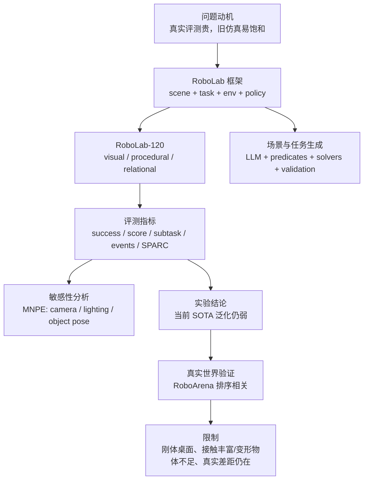

# 精讲 15：全文总梳理 + 审稿人视角评价 + 未来优化创新方向

<!-- FINAL-20260621-UPDATE:BEGIN -->

> [!TIP]
> **2026-06-21 复现实证更新**：审稿式评价现在可以引用本轮 Pi05 结果：full-120 artifact 成功率为 120/120，但 policy task success 为 `34/120 = 28.3%`。这正好说明 RoboLab 能区分“系统跑通”和“策略泛化成功”。

<!-- FINAL-20260621-UPDATE:END -->


> **【绿色标识｜核心结论】** 如果以审稿人的身份看，RoboLab 的主要价值不在于提出一个单点算法，而在于把“高保真仿真、任务生成、策略接入、细粒度诊断、扰动敏感性、真实世界相关性”打成一个可运行的评测框架。它更像一篇 benchmark/system paper，而不是纯算法 paper。
>
> **【蓝色标识｜来源路径】** 本节综合论文 Abstract、Introduction、III RoboLab、IV Experiments、V Limitations、VI Conclusion，以及 GitHub README 里的 benchmark、server-client policy、multi-env evaluation、dashboard、installation 和 hardware 信息。
>
> **【橙色标识｜审稿边界】** 下面的“审稿意见”是学习和复现视角的技术评价，不代表真实会议评审结论。它的目的不是给论文打标签，而是帮我们判断：这篇论文强在哪里、弱在哪里、复现时还要补哪些证据，以及未来可以从哪里做创新。

## 1. 从全文角度，一句话讲清楚这篇论文

RoboLab 想解决的问题是：

```text
现有机器人 benchmark 要么真实世界太贵，
要么仿真太低保真、太容易被训练集/环境重叠“刷满”，
导致我们不知道通用机器人策略到底有没有真正泛化。
```

它的回答是：

```text
用 Isaac Lab/Isaac Sim 搭一个高保真、可扩展、可自动评分的仿真评测平台；
用 RoboLab-120 覆盖视觉、过程化、关系三类能力；
用 success/score/subtask/event/SPARC/MNPE/dashboard 把失败拆细；
再和真实世界 RoboArena 做排序相关性验证。
```

说人话：

> RoboLab 不是教机器人怎么做任务，而是给通用机器人模型出一套更难、更真实、更能解释失败原因的考试。

## 2. 全文结构总图



## 3. 审稿人视角：论文定位

### 论文类型

| 维度 | 判断 |
|---|---|
| 类型 | Benchmark / system / evaluation paper |
| 主要贡献 | 评测平台、任务集、诊断工具、扰动分析、真实相关性验证 |
| 不是重点 | 新 policy architecture、新训练算法、新控制器 |
| 适合读者 | 机器人评测、VLA 模型、仿真平台、Isaac/Omniverse、robot generalization |

### 我会给的总体评价

```text
倾向：Weak Accept / Accept 边界
理由：贡献完整、工程量大、问题重要、实验能暴露当前模型短板；
但真实世界相关性样本仍有限，任务覆盖仍偏桌面刚体，部分生成/仿真保真度的外部有效性还需要更强证明。
```

这里的判断比较务实：  
作为“提出新算法”的论文，它不强；作为“给领域提供评测基础设施和诊断方法”的论文，它很有价值。

## 4. 主要贡献拆解

| 贡献 | 审稿人会怎么看 | 强度 |
|---|---|---|
| RoboLab 框架 | 把任务、场景、机器人、策略和扰动绑定成可复现实验 | 强 |
| RoboLab-120 | 120 个新任务，按能力轴和难度组织 | 中强 |
| 细粒度指标 | success 之外有 score、subtask、event、trajectory metrics | 强 |
| MNPE 敏感性分析 | 用 posterior 看哪些扰动最影响成功 | 中强 |
| LLM scene/task generation | 提供可扩展任务生成路线和 validation/repair | 中强 |
| real-world verification | 和 RoboArena 排名相关，证明 proxy 价值 | 中 |
| GitHub/工具链 | 有 repo、dashboard、policy client、multi-env | 强，但复现成本高 |

## 5. 论文最强的地方

### 5.1 它把“泛化失败”拆细了

很多 benchmark 只给：

```text
success rate = 多少任务成功
```

RoboLab 给的是：

```text
success: 最后完成了吗
score: 做到哪一步了
subtask: 哪个中间条件过了
event: 抓错、掉落、碰撞、撞飞了吗
SPARC/path/speed: 动作质量如何
MNPE: 哪些扰动最影响结果
```

这对研究很重要。因为模型失败不是一个单一类别：

- 可能看错对象。
- 可能理解了对象但没抓稳。
- 可能会单步，不会组合。
- 可能 default instruction 会，vague instruction 不会。
- 可能外部相机能忍，腕部相机偏一点就崩。

**【绿色标识｜审稿赞点】** RoboLab 的真正强点是“诊断粒度”，不是“任务数量”本身。

### 5.2 它把 benchmark 饱和问题重新拉高难度

论文指出旧 benchmark 常有训练/测试域重叠，导致成功率容易饱和。RoboLab 的策略是：

- 使用真实世界训练策略。
- 在高保真仿真中做新任务。
- 任务按视觉、过程化、关系能力组合。
- 增加语言抽象、场景 clutter、长时序、扰动。

这让 benchmark 更像泛化考试，而不是训练集复述。

### 5.3 工程闭环比较完整

GitHub README 显示它不是只有论文图：

- RoboLab-120 任务。
- 自动成功/失败检测。
- server-client policy architecture。
- multi-environment parallel evaluation。
- dashboard。
- scene/task generation skills。
- Isaac Sim 5.0 / Isaac Lab 2.2.0 / uv sync 工程链路。

从复现角度，这种可运行工具链比只发 PDF 更有价值。

## 6. 主要问题和审稿质疑

### Major Concern 1：真实世界相关性还不够细

论文做了 RoboLab success rate 和 RoboArena Elo 的相关性比较。这个方向是对的，但审稿人会追问：

- 参与比较的策略数量是否足够？
- 相关性是 policy-level，不是 task-level。
- 是否有 motion-level 行为一致性？
- 仿真里成功/失败的原因和真实世界失败原因是否一致？

当前论文已经承认 deeper task-level and motion-level correlation 留给 future work。

**建议优化**：

```text
RoboLab score / event taxonomy / trajectory metrics
vs
真实机器人 event / human-labeled failure / trajectory smoothness
```

做成多层相关性，而不是只比较最终排名。

### Major Concern 2：任务覆盖仍偏刚体桌面

论文 limitations 明确说目前主要是 rigid-body tabletop scenes。  
这意味着它暂时不充分覆盖：

- cloth、cables、bags。
- force-control。
- compliant interaction。
- fine-grained friction。
- open-ended household tasks。

对 VLA 模型来说，这些恰好是现实世界很难的一部分。

**建议优化**：

增加分层 benchmark：

```text
RoboLab-Rigid
RoboLab-Deformable
RoboLab-ContactRich
RoboLab-LongHorizon
RoboLab-MobileManipulation
```

不要强行把所有任务塞进同一套谓词和评分系统。

### Major Concern 3：自动生成任务的有效性还需要长期治理

LLM 生成 scene/task 很有吸引力，但审稿人会关心：

- 生成任务是否有隐性偏差？
- 是否覆盖真实家庭任务分布？
- 是否会产生大量“看似合理但不重要”的任务？
- task validity 不等于 task usefulness。
- benchmark 是否会随着 LLM prompt 改动而漂移？

**建议优化**：

建立 task governance：

- 任务版本号。
- 任务生成 prompt 版本。
- object/scene coverage report。
- task usefulness human audit。
- adversarial task split。
- holdout scene/object templates。

### Major Concern 4：仿真保真度和可交互真实性仍需更强证据

RoboLab 的高保真很强，但机器人 manipulation 的关键不只是视觉。

审稿人会问：

- collision mesh 是否和 visual mesh 对齐？
- 物体质量/摩擦是否真实？
- 接触事件和真实接触是否一致？
- 容器、堆叠、重定向任务的物理可靠性如何？
- Gaussian/NuRec 场景进入仿真后，视觉和 collider 的误差如何量化？

**建议优化**：

加入 sim fidelity audit：

```text
visual alignment score
collision alignment score
physics parameter uncertainty
contact event agreement
robot trajectory agreement
```

### Major Concern 5：评测成本仍然偏高

README 里写完整任务需要大量 GPU 时间，官方建议 48GB+ VRAM。  
这对普通实验室或 4090 用户来说是门槛。

**建议优化**：

提供分层评测协议：

| 协议 | 用途 |
|---|---|
| RoboLab-Sanity-5 | 安装验证 |
| RoboLab-Smoke-20 | 模型接入验证 |
| RoboLab-Dev-40 | 快速迭代 |
| RoboLab-120 | 论文级主 benchmark |
| RoboLab-Stress | 长时序/扰动/高难专测 |

这样可以避免所有人一上来就跑完整 RoboLab-120。

## 7. 次要问题

| 问题 | 影响 | 建议 |
---|---|---|
| README 与当前 HEAD 的 `tests/` 路径不一致 | 新用户安装验证会困惑 | 加 diagnostic script 或修 README |
| 资产下载/LFS 速度慢 | 复现门槛高 | 发布分包 manifest 和断点校验工具 |
| 4090 只能低并行 | 用户误以为不能跑 | 明确 24GB 配置的推荐 task subset |
| dashboard 强依赖结果格式 | 自定义 policy 容易写错字段 | 提供 schema validator |
| LLM 生成任务 prompt 复杂 | 二次开发不易维护 | prompt version + validation report |

## 8. 从我们复现角度看到的优化点

我们这次 4090 复现暴露了几个实际问题：

1. 全量资产下载慢，且失败原因容易混在一起。
2. no-policy smoke 和真实 policy success 很容易被混淆。
3. 单任务成功视频容易让人误以为“复现了论文”。
4. Pi05 server、client、RoboLab runner 三层进程关系需要讲清楚。
5. 复杂任务失败时，必须同时看视频、event、HDF5、JSONL，不能只看最终 success。

所以，面向复现用户，RoboLab 最该补的是：

```text
一键分级验证脚本 + 资产完整性诊断 + 小型官方 subset + 结果 schema validator + 故障路由文档
```

## 9. 未来优化创新方向

下面按“可发论文/可做项目”的方向分层。

### 方向 1：RoboLab-RealCorrelation

目标：把仿真和真实世界的相关性从 policy-level 提升到 task-level、event-level、trajectory-level。

可以做：

- 同一任务在 RoboLab 和真实机器人上跑。
- 标注真实失败原因。
- 对齐 event taxonomy。
- 比较 subtask progression。
- 比较末端轨迹与接触时序。

创新点：

```text
不是只问“哪个模型排名更高”，而是问“仿真失败原因是否预测真实失败原因”。
```

### 方向 2：RoboLab-Adversarial Task Generation

目标：不是随机生成更多任务，而是自动生成“最能暴露模型弱点”的任务。

可以做：

- 从历史失败中学习弱点。
- LLM 生成针对性任务。
- solver 保证物理可行。
- 用 active learning 选择最有信息量的任务。

创新点：

```text
benchmark 从静态题库变成自适应考官。
```

### 方向 3：RoboLab-Causal MNPE

MNPE 当前更偏 posterior sensitivity。下一步可以做 causal analysis：

- camera pose 影响成功，是因为视觉输入变差，还是因为动作分布偏了？
- object distance 影响成功，是 reachability，还是训练数据偏置？
- lighting 不敏感是否真的稳健，还是任务太简单？

可以加入：

- causal graph。
- intervention design。
- counterfactual rollout。
- failure attribution。

创新点：

```text
从“哪些变量相关”推进到“哪些变量导致失败”。
```

### 方向 4：RoboLab-Deformable / Contact-Rich

扩展当前刚体桌面 benchmark：

- cloth folding。
- cable routing。
- bag opening。
- drawer/door/fridge contact-rich manipulation。
- force/torque-aware placement。

挑战：

- 成功谓词更难写。
- 物理仿真更难稳定。
- 单纯视觉成功不够，需要力/接触指标。

创新点：

```text
把通用机器人评测从 pick-place 推向真实家庭操作。
```

### 方向 5：RoboLab-NeuralScene / NuRec Integration

把精讲12里的 NuRec/Gaussian scene 路线接进 RoboLab：

```text
真实 camera/lidar
-> NuRec / Gaussian reconstruction
-> collider mesh alignment
-> RoboLab task insertion
-> policy evaluation
```

关键评估：

- visual realism。
- collider alignment。
- robot contact stability。
- policy transfer correlation。

创新点：

```text
从程序化高保真场景推进到真实场景级数字孪生评测。
```

### 方向 6：Low-Cost Evaluation Protocol for 24GB GPUs

这是很实用的方向。为 4090/3090 用户设计官方低成本协议：

- 自动测 VRAM。
- 自动选择 `num_envs`。
- 先跑 5 个 install tasks。
- 再跑 20 个 diagnostic tasks。
- 最后按需要扩展到 120。

创新点：

```text
让 benchmark 不只属于 48GB/80GB 用户。
```

### 方向 7：Unified Policy Adapter Benchmark

目前不同 VLA 模型接入成本高。可以做统一 adapter：

```text
RoboLab obs schema
-> adapter registry
-> policy request schema
-> action schema normalization
-> latency/action-horizon logging
```

覆盖：

- OpenPI/Pi05。
- RoboChallenge policy。
- GR00T。
- ReKep-style planner。
- future VLA APIs。

创新点：

```text
把“模型接入成本”从 benchmark 变量里剥离出去。
```

### 方向 8：Failure Report Generator

把 event、video、HDF5、score 自动变成 failure report：

```text
Episode failed because:
1. wrong object grabbed at step 52
2. target dropped at step 117
3. object never reached container relation
4. wrist camera was offset by 4cm
```

可以结合 VLM 自动看视频，但最终仍以 event/HDF5 为证据主线。

创新点：

```text
从 benchmark 分数推进到自动实验诊断助手。
```

## 10. 审稿意见模板

### Summary

本文提出 RoboLab，一个面向 task-generalist robot policies 的高保真仿真 benchmark。它包含 RoboLab-120 任务集，支持视觉、过程化、关系能力评估，提供自动成功检测、subtask scoring、event tracking、trajectory metrics、MNPE sensitivity analysis 和 dashboard，并通过与 RoboArena 排名相关性验证其真实世界 proxy 价值。

### Strengths

- 问题重要，直指当前 VLA/通用机器人评测瓶颈。
- benchmark 设计不只看 success rate，诊断粒度好。
- 工具链完整，有 repo、policy client、multi-env、dashboard。
- 任务生成和验证流程有扩展性。
- 敏感性分析能给出可操作的模型弱点。
- 与真实世界 benchmark 做了相关性验证。

### Weaknesses

- 真实世界验证仍偏 policy-level，缺少 task/event/motion-level 对齐。
- 任务覆盖仍偏刚体桌面，接触丰富和变形物体不足。
- LLM 生成任务的长期治理、偏差和版本稳定性还需要更多机制。
- 仿真保真度与真实接触/物理参数的一致性还可更系统量化。
- 复现成本高，普通 24GB GPU 用户需要官方分级协议。

### Questions for Authors

1. RoboLab 和 RoboArena 的相关性是否能按任务族、能力轴、事件类型进一步拆分？
2. 对自动生成任务，如何防止 benchmark 随 prompt/LLM 版本漂移？
3. 对 collision mesh、物体质量、摩擦和接触事件，有没有真实测量校准？
4. 是否计划发布小型标准 subset，支持 24GB GPU 上的快速比较？
5. 是否能提供 failure report 自动生成，连接 event log、video 和 HDF5？

### Overall

这是一篇实用价值很高的 benchmark/system paper。它的贡献不在单个算法，而在评测生态和诊断能力。作为领域工具，它值得关注；作为长期 benchmark，它还需要更强的真实世界对齐、更广任务物理覆盖、更稳定的任务治理和更低成本的复现协议。

## 11. 我们自己的后续路线建议

围绕这篇论文继续做，建议分三条线：

### 线 A：复现线

```text
完整稳定跑 Pi05 subset
-> 按 instruction type 分组
-> 跑 camera/object/background perturbation
-> 输出 dashboard/analysis 表
-> 再扩到更多任务
```

### 线 B：对比线

```text
Pi05 vs RoboChallenge pi vs ReKep
-> 同一任务、同一场景、同一评测输出
-> 比较 success/score/event/SPARC
```

### 线 C：创新线

```text
自动失败报告
-> 弱点驱动任务生成
-> 24GB GPU 低成本评测协议
-> NuRec/Gaussian real-scene integration
```

## 小结

全文视角下，RoboLab 的价值链是：

```text
高保真仿真
-> 可扩展任务/场景
-> 多策略接入
-> 自动成功与过程评分
-> 事件和轨迹诊断
-> 扰动敏感性分析
-> 真实世界排序相关
```

审稿人视角下，它的主要优点是：

```text
问题重要 + 工程完整 + 诊断粒度高 + 可扩展
```

主要短板是：

```text
真实相关性还不够细 + 任务物理覆盖有限 + 复现成本高 + 生成任务治理仍需加强
```

未来最有价值的创新方向是：

```text
真实-仿真多层相关性
自适应/对抗任务生成
因果敏感性分析
接触丰富/变形物体 benchmark
NuRec/Gaussian 真实场景接入
24GB GPU 低成本评测协议
统一 policy adapter
自动 failure report
```
