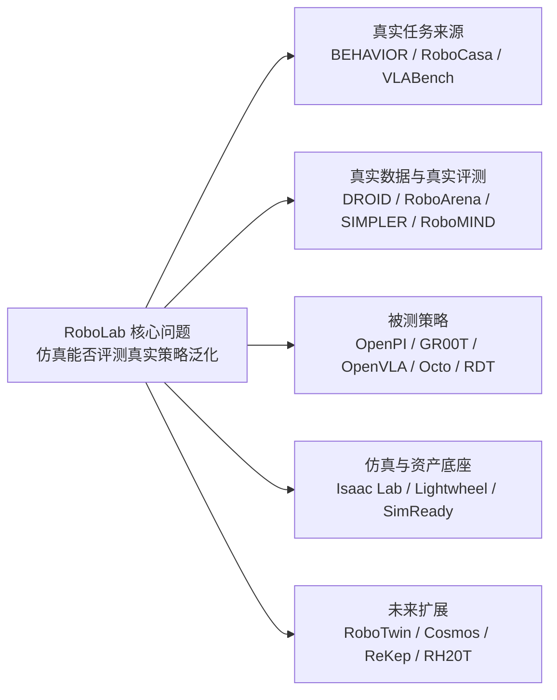

# 精讲 16：基于 RoboLab 的推荐阅读与开源学习路线

> **【绿色标识｜核心结论】** 这一版精讲 16 改成“2026 优先”。最值得先追的是：RoboLab、RoboCasa365、RDT2、NVIDIA Isaac GR00T N1.7、NVIDIA 2026 Physical AI stack、Isaac Lab-Arena、Lightwheel LW-BenchHub、Lyra。BEHAVIOR-1K/OmniGibson、DROID、RoboArena/SIMPLER、OpenVLA/Octo、ReKep、RoboTwin/RoboMIND 仍然重要，但这里降级为基础背景或对照参照。

> **【橙色标识｜阅读边界】** 下面不是“越多越好”的论文堆砌，而是按 RoboLab 复现最需要的能力来排：先读能解释当前复现的资料，再读能帮助扩展实验的资料，最后读能产生创新方向的资料。

> **【蓝色标识｜时间边界】** 当前核对时间：2026-06-20。下面“2026 优先”只收录截至此日可核对的公开论文、项目页、GitHub release 或官方发布；2025 及更早内容不删除，但不再作为最前沿主线。

---

## 1. 先说人话：RoboLab 读完以后，下一步到底补什么？

RoboLab 解决的是“怎么在高保真仿真里评测通用机器人策略”。所以后续阅读应该围绕 6 个问题展开：

| 学习问题 | 对应 RoboLab 模块 | 该读什么 |
|---|---|---|
| 怎么构造更真实、更长程的 household benchmark？ | task / scene / difficulty | 2026 优先：RoboLab、RoboCasa365；背景：BEHAVIOR-1K、VLABench、RoboTwin |
| 怎么证明仿真评测和真实机器人表现相关？ | real-to-sim evaluation | 2026 优先：RoboLab real-world verification、Isaac Lab-Arena benchmark 化；背景：DROID、RoboArena、SIMPLER、RoboMIND |
| 怎么接入和比较 VLA/generalist policy？ | policy client / action chunk / observation adapter | 2026 优先：GR00T N1.7、RDT2、π0.5；背景：OpenVLA、Octo、LeRobot |
| 怎么把资产做成可交互、可评测，而不是只好看？ | USD / SimReady / collision / physics | 2026 优先：Lightwheel LW-BenchHub、Isaac Lab-Arena、SimReady Foundation；背景：普通 USD/Omniverse 学习材料 |
| 怎么生成可扩展任务和数据？ | LLM scene/task generation | 2026 优先：RoboLab、RoboCasa365、Lightwheel LW-BenchHub、NVIDIA Cosmos / Lyra；背景：RoboTwin |
| 怎么从失败里学习？ | event log / failure diagnosis / sensitivity | 2026 优先：RoboLab event/MNPE/score 体系；背景：RoboMIND failure demos、SIMPLER、自动 failure report |

> **记忆法**：RoboLab 是“评测器”；DROID/RoboMIND 是“真实数据”；OpenPI/GR00T/OpenVLA/Octo 是“被测策略”；Lightwheel/SimReady/Isaac 是“场地和资产”；BEHAVIOR/RoboCasa/RoboTwin/VLABench 是“任务宇宙”。

---

## 2. 问题的核心来源及内容证据表

> **【蓝色标识｜为什么补这一节】** 推荐阅读不能只说“去读谁”，还要说明“这个来源本身在回答什么问题”。下面把每个核心来源的原始内容压缩成证据表：来源问题、内容要点、为什么和 RoboLab 相关、我们应该带着什么问题读。

### 2.1 主问题从哪里来？

RoboLab 的主问题不是“再做一个仿真环境”，而是：

1. 真实机器人策略评测太贵、太慢、不可复现。
2. 旧仿真 benchmark 容易饱和，训练和评测环境重叠会掩盖真实泛化能力。
3. VLA/generalist policy 不只需要 success rate，还需要知道失败发生在视觉、空间关系、过程化推理、轨迹质量、扰动敏感性还是资产/物理层。
4. 真实世界数据、仿真场景、VLA 策略、SimReady 资产、世界模型和 benchmark 工程必须连成一条证据链。

所以精讲16推荐的资料不是“相关论文合集”，而是围绕这条问题链选出来的：

### 2.2 核心来源、原始内容和我们为什么读

| 来源 | 原始内容核心 | 它回答的关键问题 | 为什么放进 RoboLab 学习路线 | 我们读它时要抓住什么 |
|---|---|---|---|---|
| [RoboLab 论文](https://arxiv.org/html/2604.09860) / [GitHub](https://github.com/NVlabs/RoboLab) | 提出高保真仿真 benchmark、RoboLab-120、visual/procedural/relational 能力轴、scene/task generation、metrics、MNPE、real-world verification。 | 仿真能不能成为真实 generalist policy 的有效评测代理？ | 它是本 notebook 的主线，定义了评测框架、任务结构、指标和证据链。 | 看 `scene -> task -> env -> policy -> event -> result -> dashboard`。 |
| [BEHAVIOR-1K](https://proceedings.mlr.press/v205/li23a.html) / [OmniGibson](https://behavior.stanford.edu/) | 以人类真实需求为来源，定义 1000 个 household activities，并用 OmniGibson 支持刚体、软体、液体等真实物理场景。 | 机器人最终应该评测哪些接近日常生活的任务？ | RoboLab 当前偏桌面 manipulation；BEHAVIOR-1K 是理解更长程家庭任务和 richer object states 的上位参照。 | 看 task taxonomy、object state、long-horizon、sim-to-real gap。 |
| [DROID](https://droid-dataset.github.io/) | 真实世界大规模 robot manipulation 数据，覆盖多地点、多场景、多任务、多采集者。 | VLA 策略的真实训练数据从哪里来？ | RoboLab 评测的是真实数据训练出的 policy；DROID 解释这类 policy 的数据分布。 | 看 camera/robot/action schema，不急着全量下载。 |
| [RoboArena](https://robo-arena.github.io/) | 真实世界分布式 policy evaluation，用 pairwise comparison / ranking 思路评估 generalist policy。 | 真实机器人评测如何更公平、更可扩展？ | RoboLab 论文用真实评测相关性支撑仿真 proxy 的意义；RoboArena 是这条证据的现实端。 | 看 ranking 机制、pairwise 比较和仿真-真实相关性的边界。 |
| [ReKep](https://rekep-robot.github.io/) | 把语言任务转成 3D relational keypoint constraints，再用层级优化生成闭环轨迹。 | 除了端到端 VLA，还有没有更可解释的关系推理控制路线？ | RoboLab 的关系任务可以用 ReKep 作为 VLA 对照：一个学动作，一个显式建约束。 | 看 keypoint function、constraint cost、hierarchical optimization。 |
| [OpenPI / π0.5](https://github.com/Physical-Intelligence/openpi) | 开源机器人 VLA 模型与工具包，π0/π0.5 通过图像、语言、状态输出连续动作/action chunk。 | 当前被测 Pi05 策略到底怎么把输入变成动作？ | 我们 4090 上实际跑的就是 OpenPI/Pi05；失败分析必须理解 observation schema 和 action chunk。 | 看 server-client、action horizon、gripper、camera keys。 |
| [Isaac Lab](https://github.com/isaac-sim/IsaacLab) / [Isaac Lab-Arena](https://github.com/isaac-sim/IsaacLab-Arena) | Isaac Lab 是基于 Isaac Sim 的机器人学习框架；Arena 用 Scene/Embodiment/Task 组合环境，面向大规模 policy evaluation。 | 评测环境如何工程化、组合化、并行化？ | RoboLab 底层依赖 Isaac 生态；Arena 是 RoboLab 思路进一步平台化的方向。 | 看 env builder、scene/embodiment/task abstraction、parallel env。 |
| [Lightwheel](https://github.com/LightwheelAI) / [LW-BenchHub](https://lightwheel.ai/release/lwlab) | 光轮提供 SimReady 资产、Isaac/Omniverse 场景、benchmark hub、teleoperation、policy training/eval pipeline。 | 真实可用的仿真资产和 benchmark hub 怎么组织？ | RoboLab 最大工程瓶颈之一是资产完整性、场景规模化、SimReady 质量。 | 看资产规范、benchmark skeleton、teleop、VLA fine-tuning。 |
| [NVIDIA SimReady Foundation](https://github.com/NVIDIA/simready-foundation) | 定义 OpenUSD content 的验证规范、profiles、features、requirements，保证资产能用于渲染、仿真、机器人和 AI training。 | 为什么普通 3D 模型不能直接变成可评测机器人资产？ | RoboLab 的 LFS、collision、scale、physics、semantic label 问题都和 SimReady 规范有关。 | 看 profiles、validation workflow、PhysX rigid-body requirements。 |
| [RDT-1B](https://github.com/thu-ml/RoboticsDiffusionTransformer) / [RDT2](https://github.com/thu-ml/RDT2) | 清华 THU-ML/TSAIL 的 robotics diffusion transformer，强调多机器人数据、统一动作空间、双臂和跨 embodiment 泛化。 | 除了 OpenPI/GR00T，国内 foundation policy 路线怎么做？ | RoboLab 可以作为 RDT/RDT2 这类策略的评测器；RDT 的统一 action space 对 adapter 很关键。 | 看 diffusion transformer、unified action space、bimanual、zero-shot embodiment。 |
| [RoboTwin / RoboTwin 2.0](https://robotwin-platform.github.io/) | 双臂 manipulation benchmark，使用 generative digital twins、对象库、任务程序合成和 domain randomization。 | 如何自动生成双臂任务、资产和专家数据？ | RoboLab 负责评测，RoboTwin 更偏生成训练数据和复杂双臂场景；两者可互补。 | 看 task program synthesis、digital twin、expert data generation。 |
| [RoboMIND](https://x-humanoid-robomind.github.io/) | 多 embodiment 真实 teleoperation 数据，包含真实失败示例，并在 Isaac Sim 构建 digital twin。 | 数据集是否可以记录失败原因，而不是只记录成功轨迹？ | RoboLab event log 可以升级成 failure dataset；RoboMIND 是失败学习的参照。 | 看 failure demos、multi-embodiment schema、digital twin。 |
| [RH20T](https://rh20t.github.io/) | 真实接触丰富任务数据，包含视觉、力、音频、动作和人类示范视频。 | 接触丰富任务需要哪些额外传感和数据？ | RoboLab 当前主要是刚体桌面任务；RH20T 指向 tactile/force/contact-rich 扩展。 | 看 force/audio/action 对齐和 contact-rich skill taxonomy。 |
| [NVIDIA GR00T](https://github.com/NVIDIA/Isaac-GR00T) | NVIDIA 的 generalist robot foundation model，输入语言、图像和状态，输出机器人动作，并支持 fine-tuning。 | NVIDIA 自己的 VLA/generalist policy 怎么接入评测？ | RoboLab 是评测器，GR00T 是候选被测策略；未来可以做 Pi05 vs GR00T 对比。 | 看 LeRobot 格式、fine-tuning、inference、action head。 |
| [NVIDIA Cosmos](https://github.com/nvidia-cosmos/cosmos-predict2.5) | 物理 AI world foundation model，面向生成/预测世界视频、合成数据和下游 customization。 | 世界模型能否补充物理仿真和数据生成？ | RoboLab 当前是 simulator-based eval；Cosmos 可用于未来场景扰动、视频预测和数据扩增。 | 看 predict/transfer/reason 三类模型和 robot/action-conditioned route。 |
| [RoboCasa / RoboCasa365](https://arxiv.org/html/2603.04356v1) | 大规模 household/kitchen simulation benchmark，包含大量厨房任务、环境和人类/合成 demonstration。 | generalist robot 在厨房和家庭环境中怎么系统评测？ | RoboLab 的桌面任务可向 household/kitchen 规模扩展；RoboCasa365 是重要参照。 | 看 task diversity、scene diversity、demonstration scale、benchmark protocol。 |
| [OpenVLA](https://github.com/openvla/openvla) / [Octo](https://github.com/octo-models/octo) / [LeRobot](https://github.com/huggingface/lerobot) | OpenVLA 是开源 VLA，Octo 是 generalist diffusion policy，LeRobot 是数据/训练/评测工具链。 | 如何统一训练、fine-tune、评测和数据格式？ | 它们决定未来 RoboLab 接多策略时 adapter 和数据格式怎么设计。 | 看 RLDS、LeRobotDataset、LoRA/fine-tuning、policy evaluation。 |
| [SIMPLER](https://simpler-env.github.io/) / [VLABench](https://github.com/OpenMOSS/VLABench) | SIMPLER 研究仿真评测和真实表现相关性；VLABench 研究语言条件、长程、常识和空间推理任务。 | 仿真评测如何证明外部有效性？语言长程任务怎么压测 VLA？ | 这两个是 RoboLab 的横向对照：一个偏 sim-real correlation，一个偏 language-conditioned task difficulty。 | 看 paired sim-real evaluation、correlation metrics、long-horizon reasoning。 |

### 2.3 这张表怎么用？

如果你要解释“为什么 RoboLab 重要”，读：

- RoboLab
- DROID
- RoboArena
- SIMPLER

如果你要解释“为什么任务难”，读：

- BEHAVIOR-1K
- RoboCasa365
- VLABench
- RoboTwin

如果你要解释“为什么策略失败”，读：

- OpenPI / π0.5
- GR00T
- RDT/RDT2
- ReKep

如果你要解释“为什么资产和仿真工程慢”，读：

- Isaac Lab / Isaac Lab-Arena
- Lightwheel
- SimReady Foundation

如果你要做下一步创新，优先组合：

- RoboLab + SimReady Foundation：做 asset preflight。
- RoboLab + RoboMIND：做 failure report / failure dataset。
- RoboLab + ReKep：做 VLA vs constraint planning 对比。
- RoboLab + RDT/GR00T/OpenVLA：做多策略 adapter benchmark。

---

### 2.4 2026 年优先补读清单：哪些才是“现在更前沿”的内容

> **【绿色标识｜2026 主线】** 如果时间有限，不要先从历史 benchmark 一路补起。先把下面这组 2026 公开成果读完，因为它们直接决定 RoboLab 后续复现、对比和创新选题。

| 2026 来源 | 时间/版本 | 类型 | 为什么更新 | 和 RoboLab 的关系 | 读法 |
|---|---:|---|---|---|---|
| [RoboLab](https://arxiv.org/html/2604.09860) / [GitHub](https://github.com/NVlabs/RoboLab) | arXiv v3，2026-05-14 | 高保真仿真评测系统 | 直接提出 RoboLab-120、三类能力轴、任务生成、扰动敏感性、真实世界相关性。 | 本 notebook 的主线；所有后续阅读都应回到它的 `scene -> task -> env -> policy -> event -> result` 链路。 | 先读 III、IV、Appendix C/D，再看代码目录。 |
| [RoboCasa365](https://github.com/robocasa/robocasa/releases) | ICLR 2026 / v1.0 release | household/kitchen benchmark | release 写明 365 个任务、2500+ 厨房场景、3200+ 3D 对象、600+ 小时人类示范、1600+ 小时机器人数据，并支持 Diffusion Policy、Pi、GR00T benchmarking。 | RoboLab 当前偏桌面 manipulation；RoboCasa365 是向厨房/家庭大规模任务扩展的近端参照。 | 看任务规模、资产规模、demo 来源和 policy benchmark 接口。 |
| [RDT2](https://github.com/thu-ml/RDT2) | arXiv 2602.03310，2026-02 | 清华 VLA / diffusion policy | repo 强调 unseen embodiment zero-shot，包含 RDT2-VQ 与 RDT2-FM，并使用 10,000+ 小时 UMI 人类操作视频。 | 适合做 OpenPI/GR00T 之外的候选策略路线；重点考察 RoboLab policy adapter 能否支持 action tokenizer / flow matching。 | 看输入输出、动作空间、zero-shot 跨 embodiment 设定和 4090 推理条件。 |
| [NVIDIA Isaac GR00T N1.7](https://github.com/NVIDIA/Isaac-GR00T) | 2026 当前 GitHub EA | NVIDIA open VLA model | repo 当前为 N1.7，说明新 VLM backbone、20K 小时 EgoScale human video、relative EEF action space、Apache-2.0，并标出 16GB+ VRAM inference。 | 它是 RoboLab 后续最自然的 NVIDIA 系策略候选；可做 Pi05 vs GR00T 对比。 | 先看 data format、inference、fine-tuning、Policy API，而不是先训练。 |
| [NVIDIA 2026 Physical AI release](https://investor.nvidia.com/news/press-release-details/2026/NVIDIA-Releases-New-Physical-AI-Models-as-Global-Partners-Unveil-Next-Generation-Robots/default.aspx) | 2026-01-05 | 官方生态发布 | 同一发布里出现 Cosmos、GR00T、Isaac Lab-Arena、OSMO、HuggingFace LeRobot integration。 | 这解释了为什么 RoboLab 不只是单篇 benchmark，而是 NVIDIA physical AI 评测生态的一环。 | 把它当作路线图，确认哪些组件可在 4090 上做小规模验证。 |
| [Isaac Lab-Arena](https://developer.nvidia.com/blog/simplify-generalist-robot-policy-evaluation-in-simulation-with-nvidia-isaac-lab-arena/) | 2026 NVIDIA blog | 可组合仿真评测框架 | 官方博客说明它由 NVIDIA 与 Lightwheel 共建，面向 scalable policy evaluation，提供 task creation、diversification、parallel benchmarking。 | RoboLab 的 task/env/policy 思想会继续平台化；Arena 是后续工程复用方向。 | 看 Scene / Embodiment / Task 抽象，以及和 LeRobot/GR00T/pi0/SmolVLA 的集成。 |
| [Lightwheel LW-BenchHub](https://lightwheel.ai/release/lwlab) / [GitHub](https://github.com/LightwheelAI) | 2026 持续更新 | benchmark hub / SimReady 资产 | Lightwheel 页面强调 SimReady scenes/assets、teleoperation、policy training/evaluation；GitHub 组织页显示 LW-BenchHub、LeIsaac、AutoDataGen 等 2026 更新项目。 | 它能补 RoboLab 最大的工程短板：资产、场景、任务、数据采集和评测 pipeline 的规模化。 | 看 LW-BenchHub、LeIsaac、SimReady assets、usd/mjcf 转换工具。 |
| [Lyra](https://research.nvidia.com/labs/toronto-ai/lyra/) | ICLR 2026 | 生成式 3D/4D Gaussian 场景 | NVIDIA Research 页面说明它用 text/image/video 生成 3D/4D Gaussian 场景，并展示导入 Isaac Sim 的方向。 | RoboLab 当前不是靠逐场景重建来扩展，但 Lyra 代表未来“快速生成候选场景，再用 Isaac/RoboLab 验证”的路线。 | 重点看生成场景如何接 OpenUSD/Isaac Sim，以及视觉真实与物理可交互之间的缺口。 |

> **【橙色标识｜历史内容降级】** 下面这些不是没用，而是不应再作为“最新成果”来讲：BEHAVIOR-1K/OmniGibson 用来理解家庭任务和 object state；DROID 用来理解真实数据分布；RoboArena/SIMPLER 用来理解真实评测和 sim-real correlation；OpenVLA/Octo 用来理解早期开放 VLA；ReKep 用来提供显式约束规划对照；RoboTwin/RoboMIND/RH20T 用来补生成数据、失败数据和接触丰富任务。

## 3. P0：和本次复现直接相关，优先读

### 3.1 NVIDIA RoboLab

- 论文：https://arxiv.org/html/2604.09860
- 官网：https://research.nvidia.com/labs/srl/projects/robolab/
- GitHub：https://github.com/NVlabs/RoboLab

**为什么读**：这是主线。先把它的 scene/task/env/policy/result/dashboard 链路看懂，再看其他资料才不会散。

**重点读法**：

1. 论文 III：框架、能力轴、任务难度、轨迹指标、MNPE。
2. Appendix C/D：scene generation、task generation、solver、prompt、DTGE。
3. GitHub：`robolab/eval/runner.py`、`episode.py`、`base_client.py`、`scene_gen/`、`tasks/benchmark/`。

**和我们 notebook 的关系**：精讲 0-15 已经把这部分拆完；精讲16是把它放进更大的学习图谱。

---

### 3.2 OpenPI / π0 / π0.5

- GitHub：https://github.com/Physical-Intelligence/openpi
- π0.5 论文：https://arxiv.org/abs/2504.16054
- π0 论文：https://arxiv.org/html/2410.24164v1

**为什么读**：我们当前 RoboLab 复现用的就是 OpenPI/Pi05 系列。理解 OpenPI，才能判断 RoboLab 里的 policy failure 是模型问题、接口问题、相机问题、action chunk 问题，还是 task 本身太难。

**重点读法**：

| 看什么 | 为什么 |
|---|---|
| observation schema | RoboLab client 要把多相机图像、关节状态、gripper、prompt 打成模型请求 |
| action chunk | VLA 一次吐出一段动作，不是每一步都重新思考 |
| π0.5 co-training | 解释为什么它比只在少数机器人数据上训练的模型更泛化 |
| server/client 推理接口 | 直接对应我们在 4090 上跑 policy server 的流程 |

**实践建议**：先不要急着 fine-tune。先固定 `BananaInBowlTask` 和 3 个复杂任务，比较 prompt、camera、action horizon、gripper binarization 对结果的影响。

---

### 3.3 Isaac Lab / Isaac Lab-Arena

- Isaac Lab GitHub：https://github.com/isaac-sim/IsaacLab
- Isaac Lab 文档：https://isaac-sim.github.io/IsaacLab/
- Isaac Lab-Arena GitHub：https://github.com/isaac-sim/IsaacLab-Arena

**为什么读**：RoboLab 运行在 Isaac Sim / Isaac Lab 生态上。Isaac Lab-Arena 又和 RoboLab 的“可组合评测环境”方向很接近，适合看后续 benchmark 工程如何标准化。

**重点读法**：

1. Isaac Lab：环境配置、ManagerBasedEnv、传感器、并行环境。
2. Isaac Lab-Arena：Scene / Embodiment / Task 三元组合思想。
3. 对照 RoboLab：RoboLab 目前已经有自己的 task、scene、policy client、dashboard；Arena 更像把这类能力抽象成通用框架。

**给 4090 的意义**：你要知道什么时候调 `num_envs`、什么时候关视频、什么时候 headless、什么时候只跑 single-env smoke。

---

## 4. P0：Stanford / Fei-Fei / OmniGibson 相关线

### 4.1 BEHAVIOR-1K / OmniGibson

- PMLR 论文页：https://proceedings.mlr.press/v205/li23a.html
- 官网：https://behavior.stanford.edu/
- GitHub：https://github.com/StanfordVL/BEHAVIOR-1K

**为什么读**：这是“人类真实需求驱动的 embodied benchmark”代表。它的任务不是只做 pick-and-place，而是清洁、做饭、整理等长程 household activity。论文作者列表里包含 Li Fei-Fei，项目由 StanfordVL 维护，是理解 RoboLab “为什么要从简单操作走向真实家庭任务”的好参照。

**和 RoboLab 的对应关系**：

| BEHAVIOR-1K | RoboLab |
|---|---|
| 1000 个日常活动 | RoboLab-120 评测任务 |
| OmniGibson 物理仿真 | Isaac Sim / Isaac Lab 高保真仿真 |
| 长程 household activity | 多步骤、关系、过程化能力轴 |
| object states：温度、湿润、开关、脏污等 | RoboLab 当前主要是刚体桌面操作，未来可扩展 |

**怎么读**：重点看“任务定义、状态表示、长程活动、sim-to-real gap”，不要一上来就全量安装。

---

### 4.2 DROID

- 官网：https://droid-dataset.github.io/
- Policy learning GitHub：https://github.com/droid-dataset/droid_policy_learning

**为什么读**：DROID 是真实机器人、多地点、多任务的数据基座。RoboLab 评测的是策略泛化，DROID 解释“真实机器人训练数据从哪里来”。

**和 RoboLab 的对应关系**：

- RoboLab：仿真中问“策略能不能泛化到复杂任务”。
- DROID：真实世界里给出大量、多场景、多任务的 demonstration。
- OpenPI / π0.5：用这类真实数据和多源数据训练策略。

**实践建议**：不要先下载大数据集。先读数据 schema、camera/robot/action 组织方式，再决定是否下载小样本。

---

### 4.3 RoboArena

- 官网：https://robo-arena.github.io/
- 论文：https://arxiv.org/html/2506.18123v1

**为什么读**：RoboLab 论文里很重要的一步是把仿真评测和真实世界 ranking 做相关性对比。RoboArena 是理解“真实世界评测怎么更公平、更分布式”的关键资料。

**重点读法**：

1. 为什么真实机器人评测贵、慢、难复现。
2. pairwise comparison / Elo ranking 为什么比单点 success rate 更适合社区评测。
3. RoboLab 的 success/score 和 RoboArena ranking 之间能建立什么关系，不能建立什么关系。

---

### 4.4 ReKep

- 官网：https://rekep-robot.github.io/
- GitHub：https://github.com/huangwl18/ReKep

**为什么读**：RoboLab 主要评估 VLA 端到端策略，而 ReKep 代表另一条路线：把语言任务变成 3D keypoint 约束，再用优化器闭环求轨迹。它特别适合和 OpenPI/Pi05 做对比。

**对比方式**：

| OpenPI/Pi05 | ReKep |
|---|---|
| 端到端 VLA，直接输出动作 chunk | VLM/LVM 生成 3D keypoint constraints |
| 强依赖训练数据分布 | 强依赖视觉 grounding 和约束质量 |
| 失败通常表现为拿错、放错、长程中断 | 失败通常表现为 keypoint 错、约束不可行、优化失败 |
| 适合 benchmark policy | 适合研究“关系约束 + 规划” |

**建议实验**：在同一组 RoboLab 关系任务上比较 Pi05 和 ReKep 思路，先做离线任务拆解，不急着接全自动执行。

---

## 5. P0/P1：清华与国内具身相关路线

### 5.1 RDT-1B / Robotics Diffusion Transformer

- GitHub：https://github.com/thu-ml/RoboticsDiffusionTransformer
- 项目页：https://rdt-robotics.github.io/rdt-robotics/
- 论文：https://arxiv.org/html/2410.07864v1

**为什么读**：RDT 是清华 THU-ML/TSAIL 线上的机器人 foundation model。它和 OpenPI/GR00T 一样都在解决“多机器人、多模态、语言条件下的动作生成”，但技术路线是 diffusion transformer。

**和 RoboLab 的关系**：

- RoboLab 负责评测。
- RDT 这类模型是候选被测策略。
- RDT 的统一 action space 对 RoboLab 的 policy adapter 设计很有启发。

**重点读法**：

1. 语言 + 多视角 RGB + proprioception 如何进入模型。
2. 为什么 diffusion action head 适合多模态动作分布。
3. unified action space 如何减少 embodiment gap。
4. 如何在 4090 上做小模型/小样本推理验证。

---

### 5.2 RDT2

- GitHub：https://github.com/thu-ml/RDT2

**为什么读**：RDT2 进一步强调 open-world generalization 和 unseen embodiment zero-shot。它适合用来思考 RoboLab 后续能不能从“评测已接入策略”变成“评测跨机器人策略泛化”。

**重点读法**：

| 看什么 | 连接到 RoboLab 的问题 |
|---|---|
| action tokenizer / VQ 路线 | RoboLab policy client 是否能统一不同动作格式 |
| flow-matching action expert | 和 Pi0/π0.5 的 action generation 有什么差异 |
| unseen embodiment | RoboLab 能否评估跨机器人迁移 |

---

### 5.3 RoboTwin / RoboTwin 2.0

- 官网：https://robotwin-platform.github.io/
- GitHub：https://github.com/robotwin-Platform/robotwin

**为什么读**：RoboTwin 关注双臂 manipulation、generative digital twins、自动任务/数据生成。这和 RoboLab 的 scene/task generation 非常接近，但 RoboTwin 更偏“生成训练数据和双臂任务”，RoboLab 更偏“评测通用策略”。

**重点读法**：

1. 从单张图/资产生成 digital twin 的思路。
2. MLLM 生成任务程序。
3. dual-arm benchmark 和 domain randomization。
4. expert data generation pipeline。

**未来创新连接**：RoboLab + RoboTwin 可以形成“自动生成复杂场景 -> 自动生成专家轨迹 -> 自动评测 VLA”的闭环。

---

### 5.4 RoboMIND

- 官网：https://x-humanoid-robomind.github.io/
- 论文：https://arxiv.org/abs/2412.13877

**为什么读**：RoboMIND 的亮点是多 embodiment、真实 teleoperation、failure demonstrations、Isaac Sim digital twin。这对 RoboLab 的 failure diagnosis 很有启发。

**重点读法**：

| RoboMIND | 对 RoboLab 的启发 |
|---|---|
| 真实成功/失败 demo | RoboLab 的 event log 可以升级成 failure dataset |
| 多机器人统一数据平台 | RoboLab policy adapter 应该标准化 observation/action |
| Isaac Sim digital twin | RoboLab real-to-sim 评测可以补真实场景校准 |

---

### 5.5 RH20T

- 官网：https://rh20t.github.io/
- API GitHub：https://github.com/rh20t/rh20t_api

**为什么读**：RH20T 是接触丰富、多模态真实机器人数据。RoboLab 当前很多任务是刚体桌面操作，RH20T 可以帮我们看到 tactile、force、audio、contact-rich skill 的真实数据复杂度。

---

## 6. P0/P1：Lightwheel / 光轮路线

### 6.1 LightwheelAI GitHub

- GitHub organization：https://github.com/LightwheelAI
- 文档：https://docs.lightwheel.net/
- Lightwheel x NVIDIA case study：https://www.nvidia.com/en-us/case-studies/lightwheel/

**为什么读**：光轮的强项是 SimReady 资产、场景、Isaac/Omniverse 生态里的数据生成和评测基础设施。RoboLab 的瓶颈之一就是资产、场景和任务规模化；Lightwheel 是很直接的工程参考。

---

### 6.2 LW-BenchHub

- 介绍页：https://lightwheel.ai/release/lwlab
- GitHub organization：https://github.com/LightwheelAI

**为什么读**：LW-BenchHub 的定位是 Isaac Lab-Arena 上的 unified benchmark hub，强调 consistent interfaces、realistic environments、multi-robot support、large-scale evaluation。它和 RoboLab 的下一步工程化方向高度重合。

**重点读法**：

1. benchmark skeleton 如何组织。
2. SimReady assets 如何进入 Isaac Lab。
3. teleoperation data collection 如何接 VLA fine-tuning。
4. 和 RoboLab 的 task/env/policy schema 如何互相映射。

---

### 6.3 Lightwheel-simready-asset / Lightwheel_Kitchen / mjcf2usd

- Lightwheel-simready-asset：https://github.com/LightwheelAI/Lightwheel-simready-asset
- Lightwheel_Kitchen：https://github.com/LightwheelAI/Lightwheel_Kitchen
- mjcf2usd：https://github.com/LightwheelAI/mjcf2usd

**为什么读**：这是资产工程路线。RoboLab 复现时 LFS 慢、资产缺失、collision/fixture 问题都会影响进度。读这些项目的价值不是“下载更多资产”，而是学习资产应该如何被组织成可训练、可评测、可交互的 SimReady 形式。

---

## 7. P0/P1：NVIDIA 物理 AI / 仿真 / 世界模型路线

### 7.1 NVIDIA Isaac GR00T

- GitHub：https://github.com/NVIDIA/Isaac-GR00T
- GR00T N1.5 项目页：https://research.nvidia.com/labs/gear/gr00t-n1_5/

**为什么读**：GR00T 是 NVIDIA 的 VLA/generalist robot foundation model 路线。RoboLab 的意义之一就是评测这类 generalist policy 到底哪里强、哪里弱。

**重点读法**：

1. 模型输入：language、images、robot state。
2. 输出：连续动作或 action chunk。
3. 数据格式：LeRobot / robot demonstrations。
4. fine-tuning 和 inference 入口。

---

### 7.2 NVIDIA Cosmos

- GitHub organization：https://github.com/nvidia-cosmos
- Cosmos Predict2.5 GitHub：https://github.com/nvidia-cosmos/cosmos-predict2.5
- 论文：https://arxiv.org/html/2501.03575v1

**为什么读**：Cosmos 代表 world foundation model / physical AI synthetic data 方向。它不是 RoboLab 里的直接依赖，但对未来“用世界模型生成扰动、补数据、做场景预测”非常关键。

**和 RoboLab 的关系**：

- RoboLab：真实 physics simulator 中评测 policy。
- Cosmos：生成或预测物理世界视频/状态，用于数据扩增、预演、场景扰动。
- 未来方向：Cosmos 生成候选场景，RoboLab/Isaac 验证物理可交互性。

---

### 7.3 SimReady Foundation

- GitHub：https://github.com/NVIDIA/simready-foundation

**为什么读**：RoboLab 复现中最容易被低估的是资产规范。一个 USD 资产能不能训练/评测，不只看外观，还看碰撞、物理属性、语义标签、尺度、材质和 LFS 组织。

**重点读法**：

| 看什么 | 为什么 |
|---|---|
| USD / USDZ / texture / LFS 管理 | 解释为什么 RoboLab 资产下载慢、指针文件会导致运行失败 |
| SimReady specs | 学习“可仿真资产”不是“普通 3D 模型” |
| verification 思路 | 后续可做 RoboLab asset preflight |

---

### 7.4 RoboCasa / RoboCasa365

- 官网：https://robocasa.ai/
- GitHub：https://github.com/robocasa/robocasa
- RoboCasa365 论文：https://arxiv.org/html/2603.04356v1

**为什么读**：RoboCasa/RoboCasa365 是 household/kitchen generalist robot simulation 的重要路线。RoboLab 当前已能评测桌面 manipulation，RoboCasa365 提供更大规模 kitchen task、demonstration 和环境多样性参考。

---

## 8. P1：通用 VLA / generalist policy 开源路线

### 8.1 OpenVLA

- GitHub：https://github.com/openvla/openvla
- 论文：https://arxiv.org/html/2406.09246v1

**为什么读**：OpenVLA 是开源 VLA 的经典基线。它和 OpenPI/GR00T/RDT 的差异，能帮助我们做“不同策略接 RoboLab”的 adapter 设计。

**重点读法**：

- RLDS 数据格式。
- LoRA / full fine-tuning。
- LIBERO / BridgeData 评测流程。
- 如何把 observation/action schema 映射进 RoboLab。

---

### 8.2 Octo

- 官网：https://octo-models.github.io/
- GitHub：https://github.com/octo-models/octo

**为什么读**：Octo 是开源 generalist robot policy 的早期代表，基于 transformer/diffusion policy，强调多机器人、多任务、快速 fine-tuning。

**和 RoboLab 的关系**：适合做“非 OpenPI 系列策略”的对比基线，尤其是看 action space 和 observation adapter 需要怎么改。

---

### 8.3 LeRobot

- GitHub：https://github.com/huggingface/lerobot
- 文档：https://huggingface.co/docs/lerobot/en/index

**为什么读**：LeRobot 是更工程化的机器人学习工具链，统一 dataset、policy、训练、评测和 Hub 发布。它适合作为“把 RoboLab 输出的视频/HDF5/JSON 变成可学习数据”的中间层参考。

**重点读法**：

1. LeRobotDataset：视频 + Parquet 状态/动作。
2. dataset visualization。
3. real robot imitation learning 教程。
4. 和 GR00T/OpenPI 数据格式的兼容思路。

---

## 9. P1：评测和 sim-to-real 相关性路线

### 9.1 SIMPLER

- 官网：https://simpler-env.github.io/
- GitHub：https://github.com/simpler-env/SimplerEnv

**为什么读**：SIMPLER 的核心问题和 RoboLab 一样：仿真评测到底能不能预测真实机器人表现。RoboLab 更强调高保真、多能力轴和任务生成；SIMPLER 更强调和真实 setup 的 paired evaluation。

**重点读法**：

| SIMPLER | RoboLab |
|---|---|
| real-world policy evaluation proxy | high-fidelity benchmark evaluation |
| paired sim-real task setup | RoboArena correlation |
| MMRV / Pearson correlation | success/score/ranking correlation |

---

### 9.2 VLABench

- 官网：https://vlabench.github.io/
- GitHub：https://github.com/OpenMOSS/VLABench
- 论文：https://arxiv.org/abs/2412.18194

**为什么读**：VLABench 和 RoboLab 都在追问 VLA 的语言理解、空间推理、常识、长程操作。VLABench 更强调语言条件和长程 reasoning，RoboLab 更强调高保真仿真和细粒度策略评测。

---

## 10. 推荐阅读顺序：不要一口气全读

### 第一阶段：把当前复现做稳

1. RoboLab paper + GitHub。
2. OpenPI / π0.5。
3. Isaac Lab / Isaac Lab-Arena。
4. Lightwheel SimReady assets。

**目标**：能解释为什么 BananaInBowl 成功、为什么复杂任务失败、视频/HDF5/JSONL 分别代表什么。

### 第二阶段：理解 benchmark 为什么难

1. BEHAVIOR-1K / OmniGibson。
2. RoboCasa365。
3. VLABench。
4. RoboTwin。

**目标**：理解“多对象、多步骤、空间关系、过程化、家庭任务”为什么远比 pick-and-place 难。

### 第三阶段：理解真实数据和真实评测

1. DROID。
2. RoboArena。
3. SIMPLER。
4. RoboMIND / RH20T。

**目标**：知道仿真成功率不能直接等于真实机器人能力；要看相关性、失败类型和数据分布。

### 第四阶段：比较策略路线

1. OpenPI / π0.5。
2. GR00T。
3. OpenVLA。
4. Octo。
5. RDT / RDT2。
6. ReKep。

**目标**：把端到端 VLA、diffusion policy、flow matching、keypoint constraint、VLM planner 的差异讲清楚。

---

## 11. 8 周学习计划

| 周 | 主题 | 产出 |
|---|---|---|
| Week 1 | RoboLab + OpenPI 复现链路 | 一页图：runner -> episode -> client -> video/HDF5/JSON |
| Week 2 | Isaac Lab / Isaac Lab-Arena / SimReady | 资产 preflight checklist |
| Week 3 | BEHAVIOR-1K / RoboCasa365 / VLABench | RoboLab 与 household benchmark 对照表 |
| Week 4 | DROID / RoboArena / SIMPLER | 仿真-真实相关性评估表 |
| Week 5 | OpenPI / OpenVLA / Octo / GR00T | policy adapter 输入输出对照表 |
| Week 6 | RDT / RDT2 / ReKep | 策略路线图：VLA、DiT、constraint optimization |
| Week 7 | Lightwheel / RoboTwin / Cosmos | 生成场景和数据的 pipeline 草图 |
| Week 8 | 自己的创新 proposal | 4090 低成本评测 + failure report + asset preflight 方案 |

---

## 12. 读这些资料时最该问的 10 个问题

1. 它解决的是训练、评测、数据、仿真、资产，还是部署？
2. 输入是什么：RGB、RGB-D、语言、proprioception、force、audio、tactile？
3. 输出是什么：action chunk、EEF pose、joint action、subgoal、constraint，还是 score？
4. 它的任务是模板化指令，还是真实自然语言？
5. 它是否有真实机器人验证？
6. 它是否有失败原因记录，而不是只有 success rate？
7. 它是否能处理多对象、多步骤、空间关系和过程化操作？
8. 它的数据格式能不能转成 LeRobot / RLDS / RoboLab HDF5？
9. 它的资产是否有 collision、physics、semantic label、scale、license？
10. 它适合 4090 小规模复现，还是只适合大集群训练？

---

## 13. 我建议我们后续真正做的三个小项目

### 项目 A：RoboLab Reading Map Viewer

把本节推荐资料做成一个 JSON/HTML viewer：

- 节点：paper / repo / dataset / benchmark / model。
- 边：supports evaluation / supplies data / supplies policy / supplies assets。
- 输出：点击 RoboLab 的某个模块，就知道该读哪些论文和代码。

### 项目 B：4090 Low-Cost RoboLab Subset Protocol

基于 RoboLab-120 挑一个 12-20 task 的小子集：

- 每个能力轴至少 4 个任务。
- 每个任务只跑 1-3 episode。
- 记录 video、HDF5、event log、policy inference latency。
- 和 paper 的完整 benchmark 结果明确区分。

### 项目 C：Failure Report Generator

自动把每次失败整理成：

- 任务名、指令、对象、能力轴。
- 视频链接。
- step/time/inference latency。
- event tracker 失败原因。
- 可能归因：视觉、空间关系、过程化、资产/物理、policy adapter。
- 对应推荐阅读：比如 spatial failure 就读 ReKep/VLABench，asset failure 就读 SimReady/Lightwheel。

> **最终判断**：如果目标是“学懂并复现 RoboLab”，最先读 OpenPI、Isaac Lab、Lightwheel、BEHAVIOR-1K、DROID/RoboArena；如果目标是“做创新”，最该推进的是低成本评测协议、自动失败报告、SimReady 资产预检、VLA/constraint/RDT 多策略对比。
