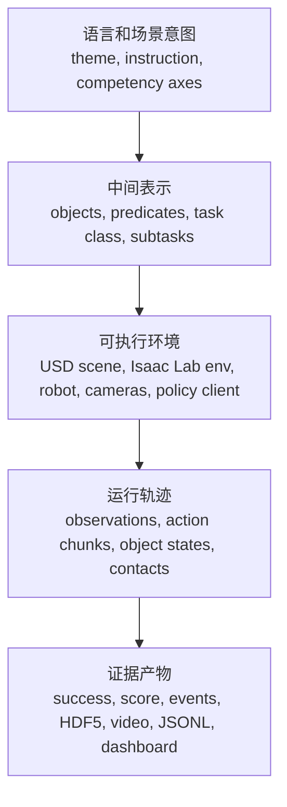

# 精讲17：RoboLab 深水区机制手册，从论文概念到源码状态机

> **【绿色标识｜核心结论】** 前面的精讲已经覆盖了论文各章节，但真正要“讲深”，不能只按论文目录继续展开。RoboLab 的本质是一条可审计的评测编译链：把自然语言任务和真实感场景，编译成 Isaac Lab 中可执行的环境，再把策略行为编译成 `success / score / event / HDF5 / video / dashboard` 这些证据。  
> **【蓝色标识｜主要来源】** 论文 `arXiv:2604.09860v3` 的 Introduction、III-A、III-B、III-C、III-D、IV、Appendix B/C/D；NVIDIA 项目页；官方 GitHub 的 `robolab/`、`policies/`、`analysis/`、`dashboard/` 目录；本地 4090 复现证据 `remote_outputs/` 与 `robolab_repro_artifacts/`。  
> **【橙色标识｜边界】** 这一章不是新增实跑结果，也不是替代源码阅读。它是“深读路线图”：告诉你每个机制该看什么输入、状态、输出和失败边界，避免把视频、跑分、资产检查、策略能力混在一起。

---

## 0. 为什么还需要这一章

你说“很多精讲不够细致、不够精深”，问题不在于缺少更多段落，而在于缺一套穿透式读法。

前面的章节更像纵向切片：

| 已有精讲 | 主要讲什么 | 容易停在哪里 |
|---|---|---|
| 精讲 1/2/3/10/11 | 场景、任务、prompt、solver | 知道模块名，但不知道数据怎么变形 |
| 精讲 4/8/13/13b | 能力轴、实验、证据链 | 知道指标，但不知道它们如何从 rollout 产生 |
| 精讲 14/14b | runtime 和源码链 | 知道文件职责，但不一定能形成调试路径 |
| 精讲 15/16 | 审稿视角和推荐阅读 | 知道未来方向，但不一定知道当前系统的可改点 |

这章换一种方式：按“机制”讲。每个机制都拆成：

```text
原问题
  -> 输入是什么
  -> 中间状态是什么
  -> 关键源码对象是什么
  -> 输出是什么
  -> 失败时怎么判断
  -> 4090 复现里看哪个证据
```

这比“某文件负责什么”更接近真实复现和调试。

---

## 1. 先立一个总心智：RoboLab 是评测编译器

可以把 RoboLab 看成一个五阶段编译器。



说人话：

1. 论文不是只问“模型会不会拿香蕉”。它问的是：面对不同视觉属性、空间关系、多步骤过程、扰动和语言说法，策略到底稳定不稳定。
2. 因此 RoboLab 必须把任务写成机器能检查的结构，而不是只保存一句自然语言。
3. 它必须把场景写成物理可执行的 USD/Isaac 环境，而不是只保存一张好看的渲染图。
4. 它必须把策略行为保存成可聚合的证据，而不是只保存一个 mp4。
5. 它必须能按能力轴、难度、任务长度、扰动维度重新切表，否则 120 个任务只是一堆独立 demo。

---

## 2. 机制一：Task 不是 Python 文件，而是评测合约

### 原问题

为什么 RoboLab 的任务不能只写成一句话，例如“把香蕉放进碗里”？

因为一句话只能给人看，不能自动评分。论文要的是规模化评测，所以任务必须变成一个可执行合约。

### 输入

任务合约至少需要这些输入：

| 输入 | 作用 |
|---|---|
| `scene` | 使用哪个 USD 场景，里面有哪些对象 |
| `instruction` / variants | 默认、模糊、具体等语言版本 |
| `contact_object_list` | 哪些对象参与接触、碰撞、事件判定 |
| `subtasks` | 任务被拆成哪些阶段 |
| `conditionals` / predicates | 什么叫成功、失败、终止 |
| `episode length` | 给策略多少时间完成 |
| `attributes` | 视觉、关系、程序能力标签和难度 |

### 中间状态

任务文件把自然语言目标转成结构化条件。例如教学上可以这样理解：

```python
TaskContract = {
    "instruction": "Pick up the banana and place it in the bowl",
    "scene": "banana_bowl.usda",
    "objects_to_track": ["banana", "bowl", "table"],
    "success_condition": "object_in_container(banana, bowl)",
    "subtasks": [
        "pick_and_place(object=banana, container=bowl)"
    ],
}
```

这不是官方完整代码，只是把任务文件的语义合约说清楚。

### 输出

任务合约最终输出给 runtime 的不是一句话，而是一组可检查对象：

```text
env_cfg
  + task instruction
  + scene import config
  + success predicates
  + subtask scoring rules
  + termination rules
  + episode metadata
```

### 失败边界

| 现象 | 不能直接下的结论 | 应该查什么 |
|---|---|---|
| 视频里像是成功了，但 `success=False` | 不一定是策略错，也可能是 predicate 边界或容器接触判定没满足 | event log、object pose、subtask score |
| 模型抓了正确物体，但没得分 | 可能只完成了 grasp，没有完成 final relation | HDF5 里的阶段状态和 event |
| 任务 import 失败 | 不一定是 Python 语法问题，也可能是资产、scene path、contact object 名称不一致 | task file、asset preflight、Isaac log |

### 4090 验证入口

本地材料里可以看：

```text
robolab_repro_artifacts/pi05_policy_smoke_summary.json
robolab_repro_artifacts/pi05_axis5_assetready_20260620_20260620_092157_episode_summary.json
remote_outputs/pi05_banana_full_20260620_015206/
```

关键不是“文件存在”，而是看同一个 episode 是否同时有：

```text
episode_results.jsonl
run_0.hdf5
log_0_env0.json
mp4 / viewport mp4
env_cfg.json
```

缺一个，证据链就少一层。

---

## 3. 机制二：Scene generation 的核心不是“让 LLM 摆物体”，而是约束编译

### 原问题

论文说几分钟生成大规模逼真场景，听起来像“LLM 写坐标”。但如果只是让 LLM 给所有物体写 `(x, y, yaw)`，很快会出现碰撞、放不下、支撑关系错、容器内部不合理。

RoboLab 的关键是让 LLM 生成 typed predicates，再由 solver 把谓词解成可执行几何。

### 输入

| 输入 | 作用 |
|---|---|
| theme | 例如 messy counter、tool sorting、breakfast table |
| object catalog | 对象名称、类别、尺寸、是否容器、是否支撑 |
| table bounds | 可放置区域 |
| placement types | `place-on-base`、`place-in`、`place-on`、`cluster-around` |
| constraints | 容器尺寸、堆叠稳定性、间距、yaw 多样性 |

### 中间表示

LLM 不应该直接输出“最终世界”，而应该输出类似：

```json
{
  "objects": [
    {"name": "bowl_0"},
    {"name": "plate_large"},
    {"name": "banana"},
    {"name": "mug"}
  ],
  "predicates": [
    {"type": "place-on-base", "object": "bowl_0", "x": 0.40, "y": 0.15, "yaw": 23},
    {"type": "place-on", "object": "banana", "support": "plate_large", "position": "center"},
    {"type": "cluster-around", "objects": ["mug"], "anchor": "bowl_0", "radius": 0.12}
  ]
}
```

这个结构的好处是：

1. 对象名可以和 catalog 做精确校验。
2. `place-on` / `place-in` 自动形成依赖顺序。
3. spatial solver 可以先解 base 物体位置。
4. physical solver 可以再解支撑、容器、z 高度。
5. 失败信息可以回写给 LLM 修复，而不是只说“生成失败”。

### 状态转移

```text
LLM JSON predicates
  -> grammar/schema validation
  -> asset catalog validation
  -> dependency order
  -> spatial 2D solve
  -> physical 3D placement
  -> collision/stability check
  -> USD scene
```

### 输出

输出不是一张图，而是：

```text
generated scene USD
  + object poses
  + asset references
  + physics-compatible placement
  + optional screenshot
  + validation report
```

### 失败边界

| 失败位置 | 典型原因 | 修复方向 |
|---|---|---|
| JSON/schema | LLM 输出 markdown、漏字段、对象名不合法 | 强化 JSON-only、字段 schema、对象名精确匹配 |
| asset validation | 选了 catalog 没有的物体，或禁用集合对象 | 替换对象或更新 catalog |
| spatial solve | base 物体太多、桌面太挤、相对关系矛盾 | 减少 anchors、增加 containment/stacking、缩小对象 |
| physical placement | 容器放不下、支撑面不够、z 高度错 | 检查 bounding box、support local frame、container clearance |
| settle simulation | 物体掉落、穿插、抖动 | 调整碰撞体、质量、初始高度、间距和 physics material |

### 深层理解

这里最重要的不是“LLM 很聪明”，而是把 LLM 限制在它擅长的层：语义规划。几何、碰撞、稳定性不让 LLM 口算，而是交给 solver 和物理仿真。

这也是 RoboLab 与逐场景 3DGS/NeRF real-to-sim 的不同：RoboLab 更像“高质量资产库 + 结构化程序化组合 + 物理检查”，不是每个真实视频都重建一次完整数字孪生。

---

## 4. 机制三：Environment 实例化是把“考题”接到“机器人身体”和“策略接口”

### 原问题

同一个任务为什么能换机器人、换 policy、换相机、换背景？

因为论文设计里 task 是 robot-agnostic / policy-agnostic 的。任务只描述目标状态，真正的机器人 embodiment、policy observation/action schema、camera 和 variation 在 runtime 绑定。

### 输入

| 输入 | 说明 |
|---|---|
| task config | 任务、场景、成功条件 |
| robot config | Franka、GR1、或其他 Isaac Lab compatible robot |
| policy config | Pi05、PaliGemma、GR00T adapter、ReKep adapter 等 |
| camera config | 外部相机、腕部相机、分辨率、视角 |
| action config | 关节位置、EEF delta、gripper、chunk horizon |
| variation config | lighting、camera pose、background、texture、object pose |

### 中间状态

```text
TaskContract
  + RobotEmbodiment
  + PolicyIOAdapter
  + SensorConfig
  + VariationConfig
  -> Isaac Lab Env
```

这个绑定阶段最容易被低估。很多“模型对比”并不公平，问题不是模型强弱，而是 adapter 没把 observation/action 对齐。

### 输出

```text
env
  + observation space
  + action space
  + cameras
  + robot articulation
  + task predicates
  + recorder hooks
```

### 失败边界

| 现象 | 深层原因 |
|---|---|
| 换机器人后任务跑不动 | workspace、gripper、action scale、IK/control mode 不兼容 |
| 取消腕部相机后性能突降 | policy 训练时依赖 wrist view，输入分布改变 |
| 改相机角度后模型抓错 | object visibility、occlusion、pixel-to-action prior 改变 |
| 背景扰动后失败 | VLA 视觉 backbone 对纹理/语义 distractor 敏感 |
| ReKep 不能直接当 VLA 跑 | ReKep 输出的是约束/优化轨迹，不是同样的 action chunk client |

### 4090 复现启发

所以实验顺序应该是：

```text
先固定 Pi05 + 官方任务 + num_envs=1
  -> 确认可完整产出证据
  -> 再扩到每轴任务子集
  -> 再做扰动
  -> 最后换 policy 或 robot
```

这不是保守，而是在控制变量。

---

## 5. 机制四：Policy rollout 是一个多状态闭环，不是一次模型调用

### 原问题

为什么 `Pi05 server` 在线还不代表任务能完成？

因为策略评测不是 `obs -> action` 一次调用，而是跨数百个 simulation steps 的闭环。

### 输入

每个 step 或 action chunk 需要：

| 输入 | 可能来源 |
|---|---|
| RGB 图像 | external camera、wrist camera |
| robot proprioception | joints、EEF pose、gripper state |
| language instruction | task variant |
| previous action / chunk state | client cache |
| environment time | episode step、dt、decimation |

### 中间状态

```text
observation dict
  -> policy client preprocess
  -> server request
  -> model inference
  -> action chunk
  -> local chunk cache
  -> env.step(action)
  -> new world state
```

对于 chunked action policy，模型可能不是每一步都重新推理。它会生成一段动作，然后 runtime 分步消费。

### 输出

每个 step 最终会贡献：

```text
next observation
object poses
contacts
subtask states
events
recorder frame
video frame
timing
```

### 失败边界

| 失败类型 | 应该怎么区分 |
|---|---|
| policy server 慢 | 看 inference latency，不先怪 Isaac |
| action 方向错 | 看 action coordinate frame / scaling / gripper convention |
| 轨迹平滑但没完成 | 看 semantic/relational reasoning，而不是低层控制 |
| 轨迹抖动 | 看 controller、chunk stitching、simulation dt、SPARC |
| 多 env 串数据 | 看 env_id 隔离、chunk cache、recorder path |

### 说人话例子

如果模型在 `RedDishesInBinTask` 抓了一个红色盘子但没放进 bin，不能简单写“视觉失败”。更合理的拆法是：

```text
视觉识别：可能成功，因为它选到了红色盘子
空间/目标关系：可能部分失败，因为没有进入 bin
程序执行：可能失败，因为 release、trajectory、gripper timing 不对
事件证据：需要看 wrong object / drop / collision / object moved
```

这就是为什么 `score`、event log 和 video 必须一起看。

---

## 6. 机制五：WorldState 和 EventTracker 是把物理轨迹翻译成人能读的失败原因

### 原问题

为什么论文强调不只看 success rate？

因为 success rate 只有一位信息。`success=False` 不能告诉你模型错在看不懂颜色、搞错空间关系、抓取失败、重定向失败，还是撞飞了无关物体。

### 输入

```text
object poses
robot contacts
gripper state
subtask predicates
previous event states
task target objects
```

### 中间状态

WorldState 把 Isaac 里的低层状态整理成 predicate 可消费的形式：

```text
banana pose
bowl pose
banana in bowl?
robot grasping banana?
wrong object moved?
object fell?
target object near goal?
```

EventTracker 再把连续状态压缩成稀疏事件：

```text
grasp target
drop target
wrong object grasped
object collision
target relation satisfied
subtask completed
```

### 输出

| 输出 | 用途 |
|---|---|
| `success` | 最终是否满足任务成功条件 |
| `score` | 子任务/事件完成比例 |
| event log | 失败诊断 |
| HDF5 | 逐步复盘 |
| dashboard table | 聚合分析 |

### 深层理解

这一步是 RoboLab 的科学价值所在。没有事件层，论文只能说“模型成功率低”。有了事件层，才能进一步问：

```text
模型是不是常拿错物体？
是不是能拿对但放不准？
是不是长程任务前半段能做、后半段崩？
是不是对模糊语言更敏感？
是不是相机扰动比背景扰动更致命？
```

---

## 7. 机制六：`success`、`score`、`SPARC`、`MNPE` 回答的是四类不同问题

| 指标/方法 | 回答的问题 | 不能回答的问题 |
|---|---|---|
| `success` | 最终目标是否完成 | 为什么失败、过程是否接近成功 |
| normalized `score` | 子任务和事件完成了多少 | 动作是否平滑、是否高效 |
| SPARC / speed / path length | 轨迹质量、平滑度、效率 | 语义是否理解正确 |
| MNPE | 哪些扰动参数最影响成功 | 单个 episode 的详细失败原因 |

不要把它们混用。

### 一个具体判断模板

```text
如果 success=0, score=0.75:
  说明任务未完全完成，但大部分子目标可能完成。

如果 success=1, SPARC 很差:
  说明完成了任务，但动作可能不平滑或绕远。

如果 success 均值高，但 MNPE 显示某相机角度 posterior 高风险:
  说明平均表现不错，但有特定视觉条件脆弱。

如果 video 看起来成功，score/success 不一致:
  先查 predicate 坐标、container boundary、object pose、event log。
```

### 对我们已有 4090 结果怎么读

已有 Pi05 结果里，`BananaInBowlTask` 单任务成功说明闭环可跑；15 个 asset-ready 任务里 9/15 成功说明可以开始按能力轴读差异；但这仍不是 full RoboLab-120 论文级复现，因为：

1. 任务规模不够。
2. episode 重复数不够。
3. full-120 里仍有资产/contact 层失败需要先分流。
4. 扰动实验只有部分形成有效 episode。
5. RoboChallenge/ReKep/GR00T 等对照仍需要 adapter 或统一 action schema。

这叫“可计分子集复现”，不是“论文全量复现完成”。

---

## 8. 机制七：Perturbation 不是随便改参数，而是因果探针

### 原问题

“调整相机角度会怎样？”、“取消腕部相机会怎样？”、“换机器人会怎样？”这些问题不是普通 ablation，而是因果探针。

要让结论可信，必须固定：

```text
policy
task
episode count
seed / initial object set
instruction variant
robot embodiment
output schema
```

然后只改一个变量。

### 合格扰动矩阵

| 变量 | 合格改法 | 不合格改法 |
|---|---|---|
| camera pose | 同任务同 policy，改 pitch/yaw/distance，保留输出 schema | 顺手换任务、换语言、换模型 |
| wrist camera | 保留字段但遮蔽或置空，并明确 policy 输入变化 | 直接删字段导致 client schema 崩 |
| background | 同 object pose 和 camera，换背景材质/图片 | 同时换 lighting 和 object pose |
| object pose | 小范围可达扰动，记录 seed 和 pose delta | 随机到不可达区域 |
| robot | 保持任务和目标，单独换 embodiment 并对齐 action adapter | 只换 USD，不改 control/action/workspace |

### 失败边界

扰动实验最常见的错误是把“配置跑通”误读成“策略评测有效”。

例如 lighting runner 如果只产生 summary groups=0，这说明它没有形成有效策略 episode，不能拿它当成功率统计。正确记录应该是：

```text
lighting perturbation: runner invoked, but no valid scored episode groups
status: invalid_for_policy_success_comparison
next step: inspect runner output selection and result parser assumptions
```

---

## 9. 机制八：Baseline 对比要先分三类，不能一股脑拉模型

你提到 Pi05、GR00T、PaliGemma、Cosmos、阿里的模型、RoboChallenge Pi、ReKep。这里要先分层。

| 类别 | 例子 | 是否可直接进 RoboLab success rate 表 |
|---|---|---|
| 直接动作策略 | Pi05、pi0、pi0-FAST、PaliGemma OpenPI family | 相对容易，前提是官方 client 支持 |
| 需要 adapter 的 VLA/robot policy | GR00T、RDT、Qwen/阿里具身模型 | 需要 observation/action schema 对齐 |
| 非同类方法或世界模型 | ReKep、Cosmos | 需要转成 planner/controller 或生成数据流程，不能直接当同口径 policy |

### 为什么 ReKep 不能直接和 Pi05 同表

Pi05 通常是：

```text
RGB + language + robot state -> action chunk
```

ReKep 更像：

```text
RGBD / 3D scene + language -> keypoint constraints -> optimization/controller -> actions
```

它可以做对照，但对照口径应是“显式约束规划 baseline”，不是“同接口 VLA policy”。否则失败可能来自 adapter，而不是方法本身。

### 为什么 Cosmos 也不能直接同表

Cosmos 更偏 world model / physical AI stack，它可以用于：

1. 生成扰动视频或合成数据。
2. 做未来状态预测。
3. 作为训练/预演工具。

但它不是拿到 RoboLab observation 后直接输出 robot action 的 policy。要比较，需要定义新的 pipeline。

---

## 10. 机制九：4090 上应该怎么分层推进，才符合论文思路

4090 不是不能跑，但 24GB VRAM 决定了推进方式要分层。

### 正确层级

| 层级 | 目标 | 成功标志 |
|---|---|---|
| L0 install | 依赖、Isaac、assets、policy server 可用 | 能 import、server 启动 |
| L1 env smoke | 单任务空动作/短步初始化 | env 能 reset/step，日志落盘 |
| L2 policy smoke | Pi05 单任务闭环 | 有 `success/score/video/HDF5/event` |
| L3 asset-ready subset | 每能力轴至少 5 个任务 | 每任务完整 episode_results/HDF5/video/log |
| L4 perturb probe | 中等成功率任务做扰动 | baseline 与 perturb 同口径可比 |
| L5 baseline compare | 换 policy/method | adapter 对齐后才统计 |
| L6 paper-level | full-120 多 episode | 统计置信、按轴/难度/长度出表 |

### 为什么不能跳到 L6

因为 full-120 的失败有三种：

```text
资产/接触/scene 失败
runtime/config/parser 失败
policy 能力失败
```

如果不先分流，最终 0 分表会把工程失败和模型失败混在一起。

---

## 11. 机制十：真正的“深度阅读”应该沿这条调试路径走

当一个 episode 失败时，不要先写结论。按下面顺序走。

```text
1. task 是否调起
   -> task name / registry / task metadata

2. scene 是否可加载
   -> USD asset path / LFS / collision / contact sensor

3. env 是否能 reset/step
   -> Isaac log / env_cfg / robot articulation

4. policy 是否收到正确 observation
   -> RGB key / wrist camera / proprioception / instruction

5. action 是否合理
   -> action scale / gripper / coordinate frame / chunk cache

6. world state 是否正确解释
   -> object pose / contact / container relation / support relation

7. event 是否记录到
   -> wrong object / drop / collision / subtask done

8. summary 是否聚合正确
   -> episode_results.jsonl / read_results.py / dashboard loader
```

如果跳过前 7 步只看最终表，很容易把 bug 写成论文结论。

---

## 12. 两个“说人话”的完整例子

### 例子 A：`BananaInBowlTask` 为什么是好 smoke

它好，不是因为简单，而是因为它覆盖了完整闭环：

```text
language: pick banana and place in bowl
visual: identify banana/bowl
spatial: bowl is target container
procedural: grasp -> move -> release
predicate: banana in bowl
evidence: video + HDF5 + event log + JSONL
```

所以它适合作为 L2 policy smoke。它不能代表 full RoboLab-120，但能证明：

```text
Pi05 server-client path works
camera observation is usable
action chunk can drive robot
recorder and summary can write evidence
predicate can produce success=True
```

### 例子 B：`RedDishesInBinTask` 这类任务为什么更能暴露能力边界

它比香蕉任务更难，因为它不只是一个对象和一个容器：

```text
visual: red + dish semantics
relational: target relation is in-bin
procedural: grasp/release multiple possible targets
failure ambiguity: wrong red object, wrong dish, correct object wrong container, drop/collision
```

因此失败要拆：

```text
拿了非红色物体 -> 视觉属性失败
拿了红色但不是 dish -> 语义类别失败
拿了正确 dish 但没进 bin -> 空间/执行失败
撞飞其他物体 -> 程序稳定性失败
```

这就是为什么复杂任务必须要 event log。

---

## 13. 深水区检查表

以后每补一条精讲或每跑一组实验，都按这张表自查。

| 检查项 | 合格标准 |
|---|---|
| 是否说明原问题 | 不是只说“代码在哪里”，而是说为什么需要这个机制 |
| 是否说明输入 | 包括 language、scene、policy、robot、variation、episode 参数 |
| 是否说明中间状态 | task contract、predicate、world state、action chunk、event 等 |
| 是否说明输出 | JSONL、HDF5、video、event、dashboard 各自用途 |
| 是否说明失败边界 | 区分资产失败、runtime 失败、adapter 失败、policy 失败 |
| 是否有 4090 证据落点 | 指向本地 artifact，而不是只引用论文 |
| 是否避免过度结论 | 小样本 smoke 不说成 full benchmark |

---

## 14. 这章补上之后，后续精讲应该怎么升级

下一轮如果继续深化，建议不是继续写“精讲18、19、20”堆编号，而是按三个深水专题补：

1. **源码逐函数导读**：挑 `runner.py`、`episode.py`、Pi05 client、WorldState、EventTracker 做逐函数中文讲解，配伪代码和真实输出字段。
2. **任务文件逐例解剖**：选 5 个任务，逐个讲 instruction、scene、objects、subtasks、conditionals、difficulty、failure mode。
3. **实验统计专题**：把 15-task asset-ready、medium probe、perturbation、full-120 preflight 全部变成一个统计 notebook，明确哪些能计入策略成功率，哪些只能计入工程诊断。

这三个比继续泛泛扩写更有价值。

---

## 15. 最后一句话

RoboLab 最容易被误解成“下载一个 benchmark 跑模型”。更准确的理解是：

```text
RoboLab = 任务语义合约 + 高保真可执行场景 + 策略接口适配 + 事件化证据链 + 统计/扰动分析
```

如果一条复现只拿到了视频，它只证明“画面跑起来了”；如果一条复现拿到了任务合约、HDF5、event log、JSONL、score、success、dashboard 汇总，并且能区分资产/runtime/policy 三类失败，它才开始接近论文想要的评测口径。
