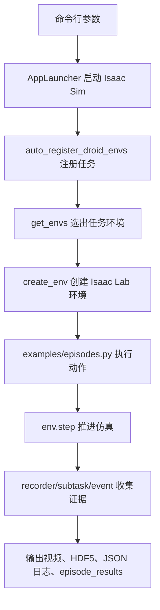

# examples 目录说人话讲解

## 这部分在论文复现里干什么

`examples/` 不是论文里真正跑 RoboLab-120 大评测的主入口。它更像“体检工具箱”：在接入 Pi0.5、GR00T 或其他 VLA 策略前，先确认 Isaac Sim 能启动、任务能注册、环境能 reset/step、动作能进机器人、视频和日志能落盘。

论文关注的是：高保真仿真能不能作为真实机器人策略的可控评测场，且不只看成功/失败，还看过程中的 subtask、事件和扰动敏感性。`examples/` 对应的是这个评测场的“开机自检”和“证据链自检”。

来源记录：
- 论文：<https://arxiv.org/html/2604.09860v3>
- 项目页：<https://research.nvidia.com/labs/srl/projects/robolab/>
- GitHub README：<https://github.com/NVlabs/RoboLab>

## 一句话理解

`examples/` 的作用是：不用真正的 VLA 策略，先拿简单动作、随机动作或录好的动作，验证 RoboLab 的环境、机器人、相机、记录器、成功条件和输出文件是不是都通。

## 总流程



## 核心文件怎么读

### `run_empty.py`

这是最重要的 smoke test。

说人话：它不给机器人一个聪明策略，只让环境跑若干步随机动作。目的不是完成任务，而是检查任务能不能被创建、相机有没有图、recorder 能不能写日志、termination/subtask 有没有报错。

输入：
- `--task BananaInBowlTask`：只跑某个任务。
- `--tag visual` 或 `--tag spatial`：按标签跑一组任务。
- `--num_envs 1`：并行环境数。4090 上调试优先用 1。
- `--num-steps 50`：随机动作跑多少步。
- Isaac Sim 参数：例如 `--headless`、`--device cuda:0`。

输出：
- `output/run_empty_env/<task_env>/env_cfg.json`：本轮环境配置证据。
- `output/run_empty_env/<task_env>/log_0_env0.json`：事件日志。
- `episode_results.jsonl`：每个 episode 一行结果。
- 可选视频或截图。

论文对应关系：
- 它不产生正式 RoboLab-120 策略结果。
- 它验证论文方法里的“可复现仿真环境”和“自动化成功/失败检测”是否可用。
- 如果这里失败，后面的 VLA 策略评测没有意义。

### `run_gripper_toggle.py`

说人话：保持机械臂不动，只开合夹爪。它用来检查动作空间最后一维夹爪控制是否有效，以及接触/视频输出是否正常。

输入：
- `--task BananaInBowlTask`
- `--num-steps 100`
- `--toggle-every 15`
- `--video-mode all|sensor|viewport|none`

输出：
- `output/run_gripper_toggle/<task_env>/<instruction>.mp4`
- `output/run_gripper_toggle/<task_env>/<instruction>_viewport.mp4`

论文对应关系：
- 过程化任务里抓取、放下、重定向都依赖夹爪动作。
- 如果夹爪通道不对，模型看起来“不会做任务”，但真实问题可能只是 action adapter 错了。

### `run_recorded.py`

说人话：不让模型推理，而是把之前录好的动作轨迹重新放进仿真里播放一遍。它用于确认“同一串动作在这个任务里是否仍然能触发同样的 subtask 和成功条件”。

输入：
- `--task RubiksCubeAndBananaTask`
- `--recorded-data-folder examples/recorded_data`
- `--enable-subtask`

输出：
- `output/playback_<folder>_<task>/<task_env>/run_0.hdf5`
- `log_0_env0.json`
- `episode_results.jsonl`
- 视频文件。

论文对应关系：
- 对应“评测指标是否稳定”的验证，不是策略能力评测。
- 特别适合排查：任务定义、谓词条件、接触传感器、HDF5 记录是否一致。

### `episodes.py`

说人话：这里放的是 examples 共用的“执行一条 episode”的小函数。

核心输入：
- `env`：Isaac Lab 环境。
- `env_cfg`：任务和仿真配置。
- `actions`：随机动作、录制动作或夹爪切换动作。

核心输出：
- `success` 或 `env_results`。
- `subtask_status`。
- 视频帧。
- HDF5 轨迹。

注意：
- 真正策略评测的 episode runner 不在这里，而在 `robolab/eval/episode.py`。
- `examples/episodes.py` 更偏调试和验证。

## 最值得关注的输入输出

| 场景 | 输入 | 输出 | 用来判断什么 |
|---|---|---|---|
| 环境能不能启动 | task/tag, num_envs, Isaac 参数 | env_cfg.json | 任务和仿真配置是否创建成功 |
| 相机是否正常 | enable_cameras, video_mode | mp4/png | 模型未来看到的图是否正常 |
| 动作通道是否正常 | random action, gripper action, recorded action | 视频、HDF5 actions | 动作维度和机器人控制是否匹配 |
| 成功条件是否正常 | task terminations/subtasks | log_*.json, episode_results.jsonl | 谓词、subtask、事件是否按预期触发 |

## 读代码时的关键判断

1. `AppLauncher` 必须先启动，再导入很多 Isaac/RoboLab 模块。
2. `auto_register_droid_envs()` 是把任务注册成 Gym env 的关键。
3. `create_env()` 才真正创建仿真环境。
4. `set_output_dir()` 决定当前任务的输出落到哪里。
5. `get_all_env_events()` 必须在 recorder 清理前取事件。
6. `episode_results.jsonl` 是后续成功率统计最核心的文件。

## 对 4090 复现的建议

先按这个顺序看：

```bash
python examples/run_empty.py --task BananaInBowlTask --num_envs 1 --headless
python examples/run_gripper_toggle.py --task BananaInBowlTask --num_envs 1 --headless
python examples/run_recorded.py --task RubiksCubeAndBananaTask --num_envs 1 --enable-subtask --headless
```

这三步都通以后，再去跑 `policies/pi0_family/run.py`，否则很容易把环境问题误判成模型问题。
