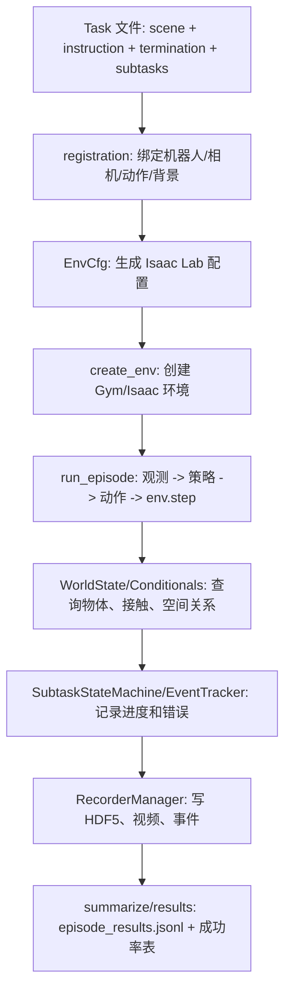

# robolab 目录说人话讲解

## 这部分在论文复现里干什么

`robolab/` 是整个项目的核心框架。论文里的“高保真仿真评测平台”“RoboLab-120 任务库”“视觉/过程化/关系三条能力轴”“自动成功检测”“subtask score 和 event tracking”等，基本都在这个目录里落地。

如果用一句话概括：`robolab/` 负责把一个 Python 任务定义，变成一个能在 Isaac Lab 里运行、能接策略、能记录轨迹、能自动判断成功失败、能输出论文指标的评测环境。

来源记录：
- 论文：<https://arxiv.org/html/2604.09860v3>
- 项目页：<https://research.nvidia.com/labs/srl/projects/robolab/>
- GitHub README：<https://github.com/NVlabs/RoboLab>

## 论文里的概念怎么落到代码

| 论文概念 | 说人话 | 代码位置 |
|---|---|---|
| Scene generation | 把物体、桌子、背景放进一个 USD 场景 | `assets/`、`robolab/core/scenes/` |
| Task generation | 用语言指令、成功条件、subtask 定义一个任务 | `robolab/tasks/benchmark/*.py` |
| Environment generation | 给任务接上机器人、相机、动作空间、灯光背景 | `robolab/core/environments/`、`robolab/registrations/` |
| Policy evaluation | 让策略看图和指令，输出机器人动作 | `robolab/eval/`，以及外层 `policies/` |
| Visual competency | 颜色、语义、大小识别 | `Task.attributes`、`constants.BENCHMARK_TASK_CATEGORIES` |
| Procedural competency | 抓取、放置、堆叠、重定向、多步骤 | `subtask.py`、`subtask_state_machine.py` |
| Relational competency | 左右、前后、中心、上下、包含等空间关系 | `conditionals.py`、`world_state.py` |
| Beyond success rate | 不只看成功，还看部分完成、错误事件、耗时、轨迹质量 | `logging/results.py`、`events/`、`metrics/` |

## 整体数据流

## 最核心的输入

### 1. 任务定义输入

位置：`robolab/tasks/benchmark/*.py`

一个任务文件通常提供：
- `scene`：用哪个 USD/USDA 场景。
- `instruction`：自然语言指令，可有 `default`、`vague`、`specific`。
- `terminations`：什么算成功，什么算超时。
- `subtasks`：过程怎么拆分，比如先抓到，再放入容器。
- `contact_object_list`：哪些物体参与接触和错误抓取检测。
- `attributes`：颜色、语义、空间、堆叠等能力标签。

以 `BananaInBowlTask` 说人话：
- 场景里有香蕉、碗、桌子。
- 指令是“把香蕉放进碗里”。
- 成功不是看模型说了什么，而是物理世界里香蕉真的在碗里、接触碗、夹爪已经松开。
- subtask 是 `pick_and_place`：先抓香蕉，再把香蕉放到碗里。

### 2. 注册输入

位置：`robolab/registrations/droid/auto_env_registrations_jointpos.py`

注册阶段把任务变成可运行环境。它会指定：
- 机器人：DROID/Franka 机械臂。
- 动作空间：joint position action。
- 观测空间：腕部相机、外部相机、proprioception。
- 背景、灯光、相机配置。
- 控制频率、渲染间隔、seed、并行 env 数。

说人话：任务本身只说“要做什么”，注册阶段才决定“用哪个机器人、让模型看到哪些相机、动作怎么控制”。

### 3. 策略输入

位置：`robolab/eval/base_client.py` 和外层 `policies/`

RoboLab 对策略的要求很简单：
- 给它当前观测 `obs`。
- 给它语言指令 `instruction`。
- 它返回下一步或一段动作 `action`。

Pi0.5/OpenPI 的实际输入大致是：
- 外部相机图像。
- 腕部相机图像。
- 机械臂关节位置。
- 夹爪位置。
- 语言 prompt。

输出是：
- action chunk：一段连续机器人动作。
- RoboLab 会按 `open_loop_horizon` 一步步消费这段动作。

## 最核心的输出

| 输出 | 位置 | 含义 |
|---|---|---|
| `env_cfg.json` | 每个 task 输出目录 | 本轮环境配置，复现实验的配置证据 |
| `episode_results.jsonl` | 实验输出根目录 | 每个 episode 一行，是成功率和表格统计的主数据 |
| `log_<run>_env<id>.json` | task 输出目录 | 稀疏事件日志，记录 subtask 变化和错误事件 |
| `run_<run>.hdf5` | task 输出目录 | 轨迹数据，含动作、状态、subtask 分数等 |
| `.mp4` 视频 | task 输出目录 | sensor/viewport 画面，用来人工复核失败原因 |
| 控制台结果表 | runner 结束时 | 按 task、属性、难度聚合的成功率、score、耗时等 |

## 核心子目录怎么理解

### `constants.py`

全局配置中心。

它定义：
- 仓库根目录、资产目录、任务目录、输出目录。
- `DEBUG`、`VERBOSE`、`ENABLE_SUBTASK_PROGRESS_CHECKING` 等开关。
- visual/procedural/relational 能力轴映射。
- simple/moderate/complex 难度阈值。

输入：无直接外部输入，主要来自仓库路径和 runner 设置的全局开关。  
输出：被所有模块读取的路径、开关和 benchmark 分类。

### `core/environments/`

这是“把任务变成仿真环境”的核心。

关键文件：
- `config.py`：动态生成 EnvCfg。
- `factory.py`：扫描任务、注册任务、按 tag/task 查询任务。
- `runtime.py`：真正创建环境、写 `env_cfg.json`、结束 episode。
- `env.py`：RoboLab 自定义环境，负责冻结已终止 env、按 env 导出记录。
- `base.py`：默认仿真参数、recorder 配置、PhysX 参数。

输入：
- Task 类。
- robot/camera/action/lighting/background 配置。
- `num_envs`、`seed`、`device`。

输出：
- Gymnasium env id。
- Isaac Lab env 对象。
- `env_cfg.json`。
- 可 step 的并行仿真环境。

说人话：这层是“厨房”。任务只是菜谱，registration 提供锅和灶，environment 这层把它们装配成能真正开火的仿真环境。

### `core/task/`

这是“怎么判断任务是否完成”的核心。

关键文件：
- `task.py`：Task 基类和任务合法性校验。
- `conditionals.py`：物理和空间谓词，比如在容器里、在左边、在上面、抓到了。
- `subtask.py`：把条件组织成可评分的 subtask。
- `conditionals_state_machine.py`：单个 subtask 内，跟踪每个对象完成到哪一步。
- `subtask_state_machine.py`：多个 subtask 按顺序推进。
- `event_tracker.py`：抓错物体、碰撞、物体移动等事件。

输入：
- 当前 `env`。
- `env_id`。
- 任务定义里的 objects、container、logical、K、score。
- WorldState 提供的物体位姿、接触、几何信息。

输出：
- 是否完成。
- 当前分数。
- 当前失败/成功原因。
- 事件状态码。

说人话：策略只管“动机器人”，`core/task/` 负责当裁判。它不相信模型自己的说法，只看仿真世界里物体到底在哪里、有没有接触、顺序对不对。

### `core/world/`

这是“读取仿真世界状态”的统一入口。

它提供：
- 查询物体、机器人、关节、link。
- 查询位姿、速度、bbox、centroid。
- 查询接触力。
- 给空间关系谓词提供几何数据。
- 给有状态谓词保存跨 step 的记忆，比如“哪个物体先放进容器”。

输入：
- Isaac Lab env。
- 物体名、机器人名、env_id。

输出：
- tensor 或 bool。
- 单 env 或 batch env 的状态查询结果。

说人话：`conditionals.py` 不直接到处翻 Isaac 数据结构，而是问 `WorldState`：“香蕉在哪？碗在哪？香蕉和碗接触了吗？”

### `eval/`

这是正式评测闭环。

关键文件：
- `runner.py`：多 task、多 episode 的总调度。
- `episode.py`：单个 episode 的核心循环。
- `base_client.py`：策略客户端抽象。
- `summarize.py`：把原始 episode 输出整理成结果行。

输入：
- 已注册任务。
- 策略 client。
- `num_envs`、`num_runs`、`instruction_type`、`video_mode`。

输出：
- `episode_results.jsonl`。
- per-env event log。
- HDF5 轨迹。
- metrics。
- 最终成功率表。

说人话：`eval/` 是正式考试流程。它让模型看图和指令，拿动作去仿真里执行，然后把裁判、录像、轨迹和统计表全部收集起来。

### `core/events/` 和 `core/logging/`

这是证据链。

`core/events/` 负责产生事件：
- subtask 进度变化。
- 抓错物体。
- 碰撞或其它错误。

`core/logging/` 负责落盘和汇总：
- 写 HDF5。
- 写 JSON 事件。
- 写 `episode_results.jsonl`。
- 计算 success rate、score、confidence interval、错误统计。

输入：
- env.step 后的状态。
- subtask state machine 输出。
- recorder buffer。

输出：
- `log_*.json`
- `run_*.hdf5`
- `episode_results.jsonl`
- 控制台汇总表。

说人话：论文说“不只看成功率”，这里就是实现。它会告诉你模型是完全不会、会抓但没放好、抓错东西、还是已经完成了一半。

## 论文三条能力轴在代码里的落点

### 视觉能力 Visual

问题：模型能不能把语言里的颜色、大小、语义和画面里的物体对上？

代码落点：
- `Task.attributes` 标注 `color`、`semantics`、`size`。
- `constants.BENCHMARK_TASK_CATEGORIES` 归到 `visual`。
- 任务指令可能是 “green fruit”、“small red yogurt”。

输入：
- 相机图像。
- 语言指令。

输出：
- 是否抓对目标。
- wrong object 事件。
- 最终 success/score。

### 关系能力 Relational

问题：模型能不能理解左、右、前、后、上、下、中心、包含、顺序等空间关系？

代码落点：
- `conditionals.py` 里的 `object_left_of`、`object_right_of`、`object_in_container`、`object_on_top`。
- `world_state.py` 提供 bbox、centroid、pose 和接触力。

输入：
- 物体几何和位姿。
- 任务中的 reference object。

输出：
- 空间谓词 bool。
- relation task 的成功/失败。

### 过程化能力 Procedural

问题：模型能不能按步骤做事，而不是只碰一下目标？

代码落点：
- `pick_and_place` composite condition。
- `SubtaskStateMachine`。
- `ConditionalsStateMachine`。
- `record_subtask_completion`。

输入：
- subtask 条件链。
- 每一步世界状态。

输出：
- 当前完成到第几步。
- partial score。
- 失败原因。

## 一次 Pi0.5 评测的真实输入输出闭环

1. `policies/pi0_family/run.py` 解析参数，比如 `--policy pi05 --task BananaInBowlTask --num-envs 1`。
2. `auto_register_droid_envs()` 注册 DROID 机器人和任务。
3. `runner.py` 选任务、创建输出目录。
4. `create_env()` 创建仿真环境。
5. `run_episode()` 每一步拿到 obs。
6. `Pi0DroidJointposClient` 把 obs 转成 OpenPI 需要的 key。
7. OpenPI server 返回 action chunk。
8. RoboLab 把 action 丢给 `env.step()`。
9. `WorldState + conditionals + subtask state machine` 判断进度和成功。
10. `summarize.py/results.py` 写出 JSONL、HDF5、视频和表格。

核心输入：
- 图像：外部相机、腕部相机。
- proprioception：关节位置、夹爪状态。
- language：instruction。
- task config：scene、success condition、subtasks。

核心输出：
- 动作执行轨迹。
- 成功/失败。
- partial score。
- reason。
- event counts。
- 视频和 HDF5 证据。

## 读源码建议

建议按这个顺序读：

1. `robolab/tasks/benchmark/banana_in_bowl_task.py`
2. `robolab/registrations/droid/auto_env_registrations_jointpos.py`
3. `robolab/core/environments/config.py`
4. `robolab/core/environments/runtime.py`
5. `robolab/eval/runner.py`
6. `robolab/eval/episode.py`
7. `policies/pi0_family/client.py`
8. `robolab/core/task/conditionals.py`
9. `robolab/core/task/subtask_state_machine.py`
10. `robolab/eval/summarize.py`
11. `robolab/core/logging/results.py`

这个顺序对应“任务是什么 -> 怎么注册 -> 怎么创建环境 -> 怎么接策略 -> 怎么判断成功 -> 怎么输出论文指标”。
